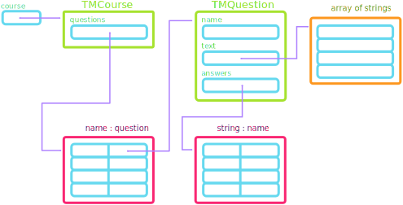
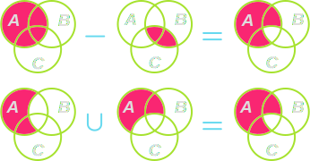

<!--
## Announcements
- Problem Set 6 due on _Saturday_!
	- I was still working on getting some autotests up for the new Problem 2, maybe they are up by now?
- New grade reports will be posted as soon as I have all of the Breakout scores in from the section leaders
- Winner of the Graphics contest was Dash, with a neat rectangle artwork program!
	- I really enjoyed all the submissions though, and the others will be entered into a drawing at the end of the semester. Thank you for submitting!
	- The last contest of the semester will be a Game Contest. Instructions up by the end of the week.
- Polling: [rembold-class.ddns.net](http://rembold-class.ddns.net)
-->
<!--
## Review Question {data-notes="Solution: [125,167,204]"}
What is the printed value of the below code?
```python
A = [
	{'name': 'Jill',  'weight':125, 'height':62},
	{'name': 'Sam',   'height':68},
	{'name': 'Bobby', 'height':72},
]
A.append({'weight':204, 'height':70, 'name':'Jim'})
B= A[1]
B['weight'] = 167
print([d['weight'] for d in A if 'weight' in d])
```


<div class='cols'>
<div class='col poll'>
<ol>
	<li> `[100,204]`</li>
	<li>`[156,173,204]`</li>
	</ol>
</div>
<div class='col poll'>
<ol style='counter-reset: li 2'>
	<li> `[100,167,173,204]` </li>
	<li>`[125,167,204]` </li>
</ol>
</div>
</div>
-->
## Review Question {data-notes="Solution: hnktge"}
::::::cols
::::col
Let's consider a greatly simplified Enigma machine, which only has one rotor that is not turning. So the signal goes through the rotor then the reflector and back through the rotor. Given the rotor and reflector mappings shown to the right, what would the word `python` encrypt to?

:::{.poll}
#. `aicmnz`
#. `hnktge`
#. `rfqbls`
#. `zghpmy`
:::

::::

::::col
\begin{tikzpicture}%%width=55%
[label/.style={font=\Large\bf, MGreen},
scale=1.8,
transform shape,
]
\node[label, MRed] at (1,0.5) {Rotor 1};
\foreach[count=\t] \a/\b in {A/D,B/M,C/T,D/W,E/S,F/I,G/L,H/R,I/U,J/Y,K/Q,L/N,M/K,N/F,O/E,P/J,Q/C,R/A,S/Z,T/B,U/P,V/G,W/X,X/O,Y/H,Z/V} {
	\node[label](a) at (0,-\t*0.5) {\a};
	\node[label](b) at (2,-\t*0.5) {\b};
	\draw[-stealth, MBlue, line width=3pt] (a) -- (b);
}


\node[label, MRed] at (6,0.5) {Reflector};
\foreach[count=\t] \a/\b in {A/U,B/Q,C/N,D/T,E/L,F/S,G/Z,H/F,I/M,J/R,K/E,L/H,M/D,N/P,O/X,P/K,Q/I,R/B,S/V,T/Y,U/G,V/J,W/C,X/W,Y/O,Z/A} {
	\node[label](a) at (5,-\t*0.5) {\a};
	\node[label](b) at (7,-\t*0.5) {\b};
	\draw[-stealth, MBlue, line width=3pt] (a) -- (b);
}

\end{tikzpicture}


::::
::::::

<!--
## Dictionary Records
- While most commonly used to indicate mappings, dictionaries have seen increased use of late as structures to store records
- Looks surprisingly close to our original template of:
  ```python
  boss = {
	  'name': 'Scrooge',
	  'title': 'founder',
	  'salary': 1000
	  }
  ```
- Allows easy access of attributes without worrying about ordering
  ```python
  print(boss['name'])
  ```


## Review Question
::::::cols
::::col
The data file to the right is read in and run using the TeachingMachine. What question do you end up at if you choose B 4 times in a row?

:::{.poll}
#. Q1
#. Q2
#. Q3
#. None of the above
:::

::::

::::col

:::{.text}
<pre style='font-size:0.5em;'>
Q1
What is the square root of 36?
	A) 0
	B) 6
	C) 10
-----
A: Q2
B: Q3
C: Q1

Q2
Are you happy?
	A) Yes
	B) No
	C) What kind of question is this?
-----
B: Q1
*: Q3

Q3
What is your age?
	A) Young
	B) Prime of my life
	C) Old
-----
A: Q1
*: Q2
</pre>
:::


::::
::::::

## An Internal Representation




## The `TMCourse` Class
```{.python style='max-height:900px; font-size:0.6em; line-height:1.2em;' data-line-numbers='32-46'}
from TMQuestion import TMQuestion

class TMCourse:

    def __init__(self, questions):
        """Creates a new TMCourse object with the specified questions."""
        self._questions = questions

    def get_question(self, name):
        """Returns the question with the specified name."""
        return self._questions[name]

    def run(self):
        """Steps through the questions in this course."""
        current = "START"
        while current != "EXIT":
            question = self.get_question(current)
            for line in question.get_text():
                print(line)
            answer = input("> ").strip().upper()
            next = question.lookup_answer(answer)
            if next is None:
                print("I don't understand that response.")
            else:
                current = next

# Implementation notes
# --------------------
# To make sure that the course starts at the first question, this method
# always includes an entry labeled "START" in the question table.

    @staticmethod
    def read_course(f):
        """Reads the entire course from the data file f."""
        questions = { }
        finished = False
        while not finished:
            question = TMQuestion.read_question(f)
            if question is None:
                finished = True
            else:
                name = question.get_name()
                if len(questions) == 0:
                    questions["START"] = question
                questions[name] = question
        return TMCourse(questions)
```

## The `TMQuestion` Class
```{.python style='max-height:900px; font-size:0.6em; line-height:1.2em;' data-line-numbers='5-9|11-13|15-17|19-24|26-39|40-53'}
class TMQuestion:

    MARKER = "-----"

    def __init__(self, name, text, answers):
        """Creates a new TMQuestion object with these attributes."""
        self._name = name
        self._text = text
        self._answers = answers

    def get_name(self):
        """Returns the name of this question."""
        return self._name

    def get_text(self):
        """Returns the list containing the text of this question."""
        return self._text

    def lookup_answer(self, response):
        """Looks up the response to find the next question."""
        next_question = self._answers.get(response, None)
        if next_question is None:
            next_question = self._answers.get("*", None)
        return next_question

    @staticmethod
    def read_question(f):
        """Reads one question from the data file f."""
        name = f.readline().rstrip()
        if name == "":
            return None
        text = [ ]
        finished = False
        while not finished:
            line = f.readline().rstrip()
            if line == TMQuestion.MARKER:
                finished = True
            else:
                text.append(line)
        answers = { }
        finished = False
        while not finished:
            line = f.readline().rstrip()
            if line == "":
                finished = True
            else:
                colon = line.find(":")
                if colon == -1:
                    raise ValueError("Missing colon in " + line)
                response = line[:colon].strip().upper()
                next_question = line[colon + 1:].strip()
                answers[response] = next_question
        return TMQuestion(name, text, answers)
```

## Mathematical Sets
- A _set_ is an unordered collection of **distinct** values.
	- **digits** =  0, 1, 2, 3, 4, 5, 6, 7, 8, 9 
	- **evens** =  0, 2, 4, 6, 8 
	- **odds** =  1, 3, 5, 7, 9 
	- **primes** =  2, 3, 5, 7 
	- **squares** =  0, 1, 4, 9 
	- **primary** =  red, green, blue 
	- **$\mathbf{R}$** =  x where x is a real number 
	- **$\mathbf{Z}$** =  x where x is an integer 
	- **$\mathbf{N}$** =  x where x is an integer >=0 
- The set with no elements is call the _empty set_ (∅)
-->

## Pythonic Sets
- Enclosed within squiggly brackets
- No key-value pairs, just single values separated by commas
```python
digits = { 0, 1, 2, 3, 4, 6, 7, 8, 9 }
squares = { 0, 1, 4, 9 }
primary = { "red", "green", "blue" }
```
- Set elements must be immutable
- Sets themselves are generally mutable
- Can **not** create an empty set just using `{ }`!
	- Python assumes this to be an empty dictionary!
	- Must instead use `set()`.

## Set Operations
- The fundamental set operation is _membership_ (∈)
	- 3 ∈ **primes**
	- 3 ∉ **evens**
	- red ∈ **primary**
	- -1 ∉ **N**
- The _union_ of the sets $A$ and $B$ ($A \cup B$) consists of all elements in either $A$ or $B$ or both.
- The _intersection_ of the sets $A$ and $B$ ($A \cap B$) consists of all elements in both $A$ and $B$.
- The _set difference_ of $A$ and $B$ ($A - B$) consists of all elements in $A$ but not in $B$.
- The _symmetric set difference_ of $A$ and $B$ ($A\triangle B$) consists of all elements in $A$ or $B$ but not in both.

## Python Implementations
- Python's built-in implementation of sets supports all these same operations
- Can either use appropriately named methods on sets or operators between sets
- Membership
	`3 in primes`{.inlinecode}

:::{.cols}
::::{.col}
- Union:
	`A.union(B)`{.inlinecode}
	`A | B`{.inlinecode .python}
- Intersection
	`A.intersection(B)`{.inlinecode}
	`A & B`{.inlinecode .python}
::::

::::{.col}
- Difference
	`A.difference(B)`{.inlinecode}
	`A - B`{.inlinecode .python}
- Symmetric difference
	`A.symmetric_difference(B)`{.inlinecode}
	`A ^ B`{.inlinecode .python}
::::
:::


## Venn Diagrams
- A _Venn Diagram_ is a graphical representation of a set which indicates common elements as overlapping areas
- The following Venn diagrams illustrate the effect of the 4 primary set operations

::::::cols
::::col

<br>


::::

::::col

<br>


::::
::::::

## Practice
If we have the following sets from earlier:

------
**digits** = { 0, 1, 2, 3, 4, 5, 6, 7, 8, 9 }
**evens** = { 0, 2, 4, 6, 8 }
**odds** = { 1, 3, 5, 7, 9 }
**primes** = { 2, 3, 5, 7 }
**squares** = { 0, 1, 4, 9 }
------

What is the value of each of the following:

- evens ∪ squares
- odds ∩ primes
- primes - evens
- odds ∆ squares


## Understanding Check
Looking at the same sets:

----
**digits** = { 0, 1, 2, 3, 4, 5, 6, 7, 8, 9 }
**evens** = { 0, 2, 4, 6, 8 }
**odds** = { 1, 3, 5, 7, 9 }
**primes** = { 2, 3, 5, 7 }
**squares** = { 0, 1, 4, 9 }
----

What is the set resulting from:
$$ (\text{primes} \cap \text{evens}) \cup (\text{odds}\cap\text{squares})$$

:::{.hpoll}
#. ∅
#. { 1, 2, 9 }
#. { 1, 3, 4, 5}
#. { 0, 3, 4, 5, 7}
:::


## Set Relationships
- Sets $A$ and $B$ are _equal_ ($A = B$) if they have the same elements.
	- This would make them the same circles in a Venn diagram
- Set $A$ is a _subset_ of $B$ ($A\subseteq B$) if all the elements in $A$ are also in $B$.
	- This would mean that the circle for $A$ would be entirely inside (or equal) to the circle of $B$
- Set $A$ is a _proper subset_ of $B$ ($A\subset B$) if $A$ is a subset of $B$ and the two sets are not equal

## Informal Proofs
- You can use Venn diagrams to justify different set identities
- Example: Say you wanted to show that:
$$ A - (B \cap C) = (A-B) \cup (A-C)$$




## Python Set Methods
- Can also use "set comprehension" to generate a set
	`{ x for x in range(0,100,2) }`{.inlinecode}

 Function | Description
---|------
`len(set)` | Returns the number of elements in a set
`elem in set` | Returns `True` if `elem` is in the set
`set.copy()` | Creates and returns a shallow copy of the set
`set.add(elem)` | Adds the specified `elem` to the set
`set.remove(elem)` | Removes the element from the set, raising a `ValueError` if it is missing
`set.discard(elem)` | Removes the element from the set, doing nothing if it is missing


## Why use sets?

Sets come up naturally in many situations
: Many real-world applications involve unordered collections of unique elements, for which sets are the natural model.

Sets have a well-established mathematical foundation
: If you can frame your application in terms of sets, you can rely on the various mathematical properties that apply to sets.

Sets can make it easier to reason about your program
: One of the advantages of mathematical abstraction is that using it often makes it easy to think clearly and rigorously about what your program does.

Many important algorithms are described in terms of sets
: If you look at websites that describe some of the most important algorithms in computer science, many of them base those descriptions in terms of set operations.


## Representing Data
- To use computation effectively, we frequently need to be able to represent real world data in a way that computers can easily work with
	- Real world data is often more complicated or nuanced than just "a list of numbers"
- Python's existing data structures are **tools**, which you can use to help represent certain ideas
	- _Lists_ when you have sequential type data, wherein there is a logical ordering to the data in question (where position matters)
		- Example: GPA over the course of 4 years
	- _Tuples_ or _classes_ when you have elements that should be grouped together but which have no inherent ordering. Generally use tuples for simple records and write custom classes for more complex. Could potentially also use a dictionary.
		- Example: Student names in a class
	- _Maps_ or _dictionaries_ when you have specific keys corresponding to other values.
		- Example: Student grades

## Tricky Data
- Human readable data is not always the best machine readable data!

Name | Class | Q1 | Mid | Q3 | Final
---|---|---|---|---|---
Sally | Python | A | B | B | A
Jake | Python | B | B | B | C
James | Astro | B | B | A |
Lily | Astro | A | A | B |
Ben | Python | C | B | B | A

- Storing the above in a 2D array would work, but would be frustrating to work with


## A Computer Friendly Approach
- Student grades are time ordered, so we could use a list for the grades
- Each student has a corresponding sequence of grades (and students are unordered), so we could use a dictionary where student names are the keys and the list of grades the values
- Each class corresponds to an unordered set of students. Could have another dictionary where the keys were the class names and the values were the dictionary of students/grades

## Example Representation
```{.python style='max-height:900px'}
{
	"Python": {
		"Sally": ["A", "B", "B", "A"],
		"Jake": ["B", "B", "B", "C"],
		"Ben": ["C", "B", "B", "A"]
	},
	"Astro": {
		"James": ["B", "B", "A"],
		"Lily": ["A", "A", "B"]
	}
}
```

## Compound Structure Storage
- Structures representing complicated data can often be large enough that you don't want to store them within your program itself
- We can put them in their own file, but reading them in with our current tools would be complicated
	- Current methods read in text, so we would need to then _parse_ the text to identify what data structures we needed to create and what elements we needed to add
	- This is certainly possible, but is sometimes more overhead than what we would like
- It can be useful then to store the data structure in a file in such a format that can be easily read into Python
