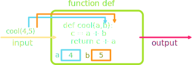

## Announcements
- Problem Set 1 is due today! 
	- I'll try to get feedback to you all on PS1, hopefully by Wednesday
- I’m trying to post Problem Set 2 by tomorrow, and it will be due next week Monday
- Don't forget you can contact your section leaders to ask questions as well!
- You have section meetings on Wednesdays and Thursdays!
- If you have just joined the course and not in section yet, see me after to class to fill out the form
- The last day you can **add/drop** a class without issue is ***Today***
- Polling continues today! Remember to use this link [https://www.polleverywhere.com/agbofred203](https://www.polleverywhere.com/agbofred203) when it becomes **active**


## Review Question {data-notes="Solution: 40"}
What is the printed value of `A` in the code below?
```idle
>>> A = 10
>>> B = 5 % 3
>>> C = A * B ** B
>>> A -= B + A // 2
>>> A, B, C = C, A, B
>>> print(A)
??
```
:::{.hpoll}
#. 3
#. 12
#. 30
#. 40
:::

## A quick String primer
- A _string_ in Python represents textual data, in form of a sequence of individual characters
	- Domain: all possible sequences of characters
	- Operations: **Many!** But we'll keep in quite simple initially
- Denoted by placing the desired sequence of characters between two quotation marks
	- `'I am a string'`
	- In Python, either single or double quotes can be used, but the ends must match
		- `"I am also a string!"`
		- `"I'm sad you've gone"`

## What is your Function?
- As discussed in the context of Karel, a _function_ is a sequence of commands that have been collected together and given a name.
- Unlike in Karel though, functions typically go beyond that and can have inputs and outputs

\begin{tikzpicture}[every node/.style={font=\sffamily}]%%width=70%
\draw[very thick, rounded corners, MGreen] (0,0) rectangle +(3,2);
\node[MGreen, anchor=south west] at (0,2) {Function};
\node[draw, very thick, MBlue, rounded corners, minimum size=1cm] at (1.5,1) {Contents};
\draw[very thick, MYellow, -stealth] (-2,1) -- +(2.25,0) node[above, pos=.25] {Inputs};
\draw[very thick, MRed, -stealth] (2.75,1) -- +(2.25,0) node[above, pos=.75] {Outputs};
\end{tikzpicture}

## Writing your own functions
:::incremental
- The general form of a function definition looks like:

	``` {.python}
	def name(parameter_list):
		#statements in function body
	```
	- `name` is your chosen name for the function
	- `parameter_list`{.no-highlight} is a comma-separated list of **variable names** that will hold each input value
- You can return or output a value from the function by including a return statement in the function body

	```python
	return expression
	```
	- `expression` is the value you want to return or output
	- If no `return` statement is included, Python will by default return `None`
:::

## A Functional Diagram



## Simple function examples
- Convert Fahrenheit temperatures to their Celsius equivalent

	```python
	def f_to_c(f):
		return 5 / 9 * (f - 32)
	```
	- Using the function:

		```python
		print(f_to_c(45))
		```
- Computes the volume of a cylinder of height `h` and radius `r`

	```python
	def cylinder_volume(r, h):
		return 3.14159 * r**2 * h
	```
	- Using the function:

		```python
		print(cylinder_volume(2,10))
		```

## Built-ins
- All modern languages include a collection of pre-defined functions for convenience
- In Python, common build-in functions that operate on numbers include:

Function | Description
--- | ---
`abs(x)` | The absolute value of x
`max(x,y,...)` | The largest of all the arguments
`min(x,y,...)` | The smallest of all the arguments
`round(x)` | The value of x rounded to the nearest integer
`int(x)` | The value of x truncated to an integer
`float(x)` | The value of x as a decimal

## Python Applications
- In Python, application programs are generally stored in files whose names end with `.py`. Such files are called _modules_.
- Most interesting applications interact with the user
	- In modern applications, this often happens through a _graphical user interface_ or _GUI_
		- We'll be constructing some GUIs later this semester!
	- For now, all interaction will happen through the terminal
		- Requires we know how to output information to the terminal and how to input information into the terminal

## Output: `print`
:::{.incremental style='font-size:.89em'}
- We've already seen examples of how to output information to the terminal
- Python's built-in `print()` command will display whatever is between the `()` to the screen
- If you want to display several things, you have options:
	- Separate each thing by a comma inside the `print` statement. This will insert a space between each when printed.
	
	  ```python
	  print(1,2,'blue')
	  ```
	- Concatenate what you want together with `+`, converting to strings as needed
		```python
		print('2000' + ' - ' + '2023')
		```
	
	  ```python
	  print(str(1) + ' ' + str(2) + ' blue')
	  ```
:::


## Boolean Expressions
- Python defines two types of operators that work with Boolean data: _relational operators_ and _logical operators_
- Relational operators compare values of other types and produce a `True`/`False` result:

	---- ----------------- - - - ---- --------------------
	`==` Equals                  `!=` Not equals
	 `<` Less than               `<=` Less than or equal too
	 `>` Greater than            `>=` Greater than or equal to
	---- ----------------- - - - ---- --------------------
- Be careful! `==` _compares_ two booleans. A single `=` _assigns_ a variable. The odds are high you'll use one when you meant the other at least once this semester!


## The Vulcan Way
- Logical operators act on Boolean pairings

	Operator | Description
	---|---
	`A and B` | True if both terms True, False otherwise
	`A or B` | True if _any_ term is True, False otherwise
	`not A` | True if A False, False if A True (opposite)

::: incremental
- Order of operations follows parentheses and then proceeds left to right
- Careful that `or` is still `True` if both options are `True` 
- Similarly, careful with combining `not` with `and` and `or`
	- "Not A or B" in common English is not the same as `not A or B`
:::

## Understanding Check
What value is printed when the code to the right runs?

:::: cols
::: col
:::::{.poll}
#. `True`
#. `False`
#. `"4Quiz"`
#. This would give an error
:::::
:::

::: {.col style="flex-grow:2;"}
```python
A = 10
B = 4
C = "Quiz"
A *= B
if A > 40 and C != "C":
	print(str(B)+C)
else:
	print(A < B or not (C == "C"))

```
:::
::::

## Shorting the Circuit
- Python evaluates _and_ and _or_ operators using a strategy called _short-circuit mode_
- Only evaluates the right operand if it actually needs to
	- Example: if `n=0`, then the `x % n == 0` is never actually checked in the statement

		```python
		n != 0 and x % n == 0
		```

		since `n != 0` already is `False` and `False and ` _anything_ is always `False`
- Can use short-circuit to prevent errors: the above `x % n == 0` statement would have erred out if `n=0`

## Input: `input`
- To retrieve data from a user, we can use Python's built-in `input()` function
- The form will generally look like:

  ```python
  variable = input(prompt_text)
  ```
    - `variable` is the variable name you want to assign the user's typed input to
	- `prompt_text` is the string that will be displayed on the screen to communicate to the user what they should be doing
- The `input()` function **always returns a string**
	- If you want to get an integer from the user, you will need to convert it yourself after retrieving it
	
	  ```python
	  num = int(input('Pick a number between 1 and 10: '))
	  ```


## Running a Program
- Python programs specify what part of the code is supposed to be executed when a program is run using a few special lines at the end of the program

	```python
	if __name__ == '__main__':
		function_to_run()
	```
	- `function_to_run` is the name of whatever function you want to execute when the program is run directly
- Patterns of this sort are commonly called _boilerplate_
	- Less important to fully understand all the pieces of it now
	- Is important to understand what it is doing and how to implement it correctly

## Sample Program
```{.python style='max-height: 900px'}

NUM_ODDS = 100 # Constant, so using all caps

def print_odds():
	"""
	Prints the first NUM_ODDS odd numbers 
	starting at 1.
	"""
	value = 1
	for i in range(NUM_ODDS):
		print(value)
		value += 2

if __name__ == '__main__':
	print_odds()
```

## Sentinels
- Many programs in programming can be approached similarly by using a particular _idiom_ or _pattern_
- A common one with repetition is to use a variable to keep track of the loop state until something particular happens (the sentinel is triggered)
<br><br>

```python
finished = False
while not finished:
	line = input("Enter a number: ")
	if line == "":
		finished = True
	else:
		print(line)
```


<!--
## Other Data Types
- Numbers are great, but what about other types of data?
- We will spend considerable time on the details of these data types later
- For now, let us introduce:
	- strings!
	- lists!


## Strings
- A _string_ in Python represents textual data, in form of a sequence of individual characters
	- Domain: all possible sequences of characters
	- Operations: **Many!** But we'll keep in quite simple initially
- Denoted by placing the desired sequence of characters between two quotation marks
	- `'I am a string'`
	- In Python, either single or double quotes can be used, but the ends must match
		- `"I am also a string!"`
		- `"I'm sad you've gone"`


## Lists
- A _list_ in Python represents a sequence of **any** type of data
- Denote by bordering with square brackets (`[`, `]`) with commas separating each element of the sequence
	- Each element could be any data type (even mixing from element to element!)
	- `['This', 'is', 'a', 'list']`
	- `['Great', 4, 'storing', 5 * 10]`
- There are many operations that we will see are possible on lists, but will start with only the basics


## Sequences
- Both _strings_ and _lists_ are examples of a more general type called a _sequence_
	- Strings are sequences of characters
	- Lists are sequences of anything
- Sequences are _ordered_, so we can number off their elements, which we call their _index_
	- Counting in Python always starts with **0**, so the first element of the sequence has index 0
- Python defines operations that work on all sequences
	- Selecting an individual element out of a sequence
	- Concatenating two sequences together
	- Determing the number of elements in a sequence

## Selection
- You can select or "pluck out" just a single element from a sequence using square brackets `[` `]`
	- There are **no** commas between these square brackets, so they can't be confused with a list
	- The square brackets come after the sequence (or variable name representing a sequence)
	- Inside the square brackets, you place the index number of the element you want to select

:::::cols
::::{.col .fragment}
```python
>>> A = [2, 4, 6, 8]
>>> print(A[1])
4
```
::::
::::{.col .fragment}
```python
>>> B = "Spaghetti"
>>> print(B[6])
't'
```
::::
:::::

## Concatenation
- _Concatenation_ is the act of taking two separate objects and bringing them together to create a single object
- For sequences, concatenation takes the contents of one sequence and add them to the end of another sequence
- The `+` operator concatenates sequences
	- This is why it is important to keep track of your variable types! `+` will **add** two integers, but will **concatenate** two strings
  
  :::::cols
  ::::{.col .fragment}
  ```python
  >>> 'fish' + 'sticks'
  'fishsticks'
  ```
  ::::
  ::::{.col .fragment}
  ```python
  >>> A = [1, 'fish']
  >>> B = [2, 'fish']
  >>> print(A + B)
  [1, 'fish', 2, 'fish']
  ```
  ::::
  :::::

## Lengths
- The number of elements in a sequence is commonly called its _length_, and can be given by the `len( )` function
- Simply place the sequence you desire to know the length of between the parentheses:

  ```python
  >>> len("spaghetti")
  9
  ```
- You can have sequences of 0 length as well!
  
  ```python
  >>> A = ""
  >>> B = [ ]
  >>> print( len(A) + len(B) )
  0
  ```

## Understanding Check
:::::cols
::::col
What would be the printed output of the code to the right?

:::poll
#. 12
#. 13
#. 14
#. 15
:::
::::
::::col
```python
A = "hots"
B = ["fire", A + A]
C = A[3] + A[1]
B += C + C[0]
D = B[0] + B[1] + B[2]
print(len(D))
```

::::
:::::

-->

<!--
## Running a Program
- Python programs specify what part of the code is supposed to be when a program is run using a few special lines at the end of the program

	```python
	if __name__ == '__main__':
		function_to_run()
	```
	- `function_to_run` is the name of whatever function you want to execute when the program is run
- Patterns of this sort are commonly called _boilerplate_
	- Less important to fully understand all the pieces of it now
	- Is important to understand what it is doing and how to implement it correctly

## Visiting the library(ies)
- A huge strength of Python is that it offers a very large number of code collections called _libraries_
	- Can save you the effort from writing that code yourself!
- Requires you to _import_ that library, which can take several different forms
	- Most common is to use `import` to grab everything in a library

		```python
		import math
		```
		- You must then access any function in that library using its _fully qualified name_, which includes the library name (`var = math.sqrt(4)`)
	- Can also use `from ... import` to grab specific functions from the library

		```python
		from math import sqrt
		```
		- You do not need to use the library name then when you call it (`var = sqrt(4)`)


## Useful `math` definitions

Code | Description
--- | ---
`math.pi` | The mathematical constant $\pi$
`math.e` | The mathematical constant $e$
`math.sqrt(x)` | The square root of x
`math.log(x)` | The natural logarithm of x
`math.log10(x)` | The base 10 logarithm of x
`math.sin(x)` | The sine of x in radians
`math.cos(x)` | The cosine of x in radians
`math.asin(x)` | The arcsin of x
`math.degrees(x)` | Converts from radians to degrees
`math.radians(x)` | Converts from degrees to radians


## An adding program

``` {.python style="max-height: 100%"}
# File: AddTwoIntegers.py

"""
This program adds two integers entered by the user.
"""

def add_two_integers():
	print("This program adds two integers.")
	n1 = int(input("Enter n1? "))
	n2 = int(input("Enter n2? "))
	total = n1 + n2
	print("The sum is", total)

# Startup boilerplate
if __name__ == '__main__':
	add_two_integers()
```
-->
