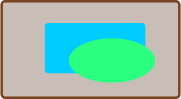

## Announcements
- Feedback on PS1 was out yesterday
- You have Problem Set 2 due on Tuesday at **12 noon**
	- You have everything you need to do all the problems after today
- I have so many meetings this afternoon, including one during normal office hours
	- Should you have any issue, ask me in the office until 10:30 am
	- Also, get help from your section leader
- - Polling continues today! Remember to use this link [https://www.polleverywhere.com/agbofred203](https://www.polleverywhere.com/agbofred203) when it becomes **active**


## The `range()` iterable
- Need an easy way to produce or describe a range of numeric values
- The built-in `range()` function handles this and produces the needed iterable object
- Takes 1, 2, or 3 arguments:
	- Start (default 0): where to start the sequence at
	- Stop (mandatory): the sequence ends just _below_ this value (does not include it!)
	- Step (default 1): what value the sequence counts by
<br><br>

:::{.block name='Warning!'}
Be careful, the `range` function will stop one step _before_ the final stop value.
:::


## For ranging examples
- Providing just a stop argument:

	```python
	for n in range(5):
		print(n)
	```
- Providing a start and stop:

	```python
	for n in range(1,11):
		print(n)
	```
- Providing a start, stop, and step:

	```python
	for n in range(10,0,-1):
		print(n)
	```

## Review Question and Understanding Check {data-notes="Answer is B, as it would not print the 0"}
Which of the below blocks of code would print something different from the others?

::::: cols

:::: col
:::{.block name=A}
```{.python style='margin-left:1em'}
for n in range(10):
	if n % 2 == 0:
		print(n)
```
:::
:::{.block name=B}
```{.python style='margin-left:1em'}
for i in range(0,10,2):
	if i > 0:
		print(i)
```
:::
::::

:::: col
:::{.block name=C}
```{.python style='margin-left:1em'}
for j in '02468':
	L = int(j)
	print(L)

```
:::
:::{.block name=D}
```{.python style='margin-left:1em'}
for k in range(0,10):
	if not (k % 2 > 0):
		print(k)
```
:::
::::
:::::


## Algorithms
- Recall that when approaching a computation problem, you **must** have an algorithm designed before you start coding
- An **algorithm** is a problem-solving strategy, and should be:
	- _Clear and unambiguous_, in the sense that it is understandable and leaves no gaps
	- _Effective_, in the sense that each step is actually possible
	- _Finite_, in the sense that it ends at some point
- You need to come up with an algorithm before you start coding!

## Creating your own Algorithms
:::{.incremental style='font-size:.9em'}
- Some useful hints to keep in mind when constructing your own algorithms:
	- Think about how you would solve the problem **without** a computer. You can't write code if you don't understand what you want the computer to do.
	- Computers are fast! Brute force methods are often very viable, or at least a good starting point.
	- Try to use tools and programming patterns you have already seen. It is often far easier to write programs by assembling pieces from code you have already seen than writing each program entirely from scratch.
		- Common patterns we have already seen include: looping over sequences, and using variables to track/control a loop
	- Recognize that the program you write is highly unlikely to work the first time
		- Errors can occasionally be in your algorithms
		- More often, early on, errors are in your translating of the algorithm into Python (the implementation)
:::

## Example: Greatest Factor
- Suppose we wanted to write a function to compute the greatest factor of a provided number (not including the number itself)
- Algorithm:

  :::incremental
  - Brute force -- check all smaller values to see if factor
  - Start at top and work down, means first found is the greatest
  - Check if factor by seeing if remainder 0
  :::

```{.python .fragment style='margin:auto;'}
def greatest_factor(num):
	"""Finds the greatest factor of a number."""
	for i in range(num-1,0,-1):
		if num % i == 0:
			return i
```

<!-- not until strings

## Learning English
- When working with sequences of characters, it is often useful or desirable to determine if they form actual valid English words
- This class provides for you a new library, through the file `english.py`
- The `english` library provides two objects you can import into your programs:
	- The constant `ENGLISH_WORDS`, which is a list of all the valid words in the English dictionary
	- The function `is_english_word()`, which accepts a single string as an argument and returns `True` is the string represents a valid English word.
- This library will be particularly useful for Wordle!


## Example: How many 2 letter words?
- Before we start writing code, let's pause. Give a physical English dictionary, how could you go about figuring out the number of two letter words?

::::::cols
::::{.col .fragment}
:::{.block name="Check valid words for right length"}
```{.python style='width: 100%' .fragment}
from english import ENGLISH_WORDS

count = 0
for word in ENGLISH_WORDS:
	if len(word) == 2:
		count += 1
print(count)
```
:::
::::

::::{.col style='flex-grow:1.15' .fragment}
:::{.block name="Check all two letter combinations"}
```{.python style='width:100%' .fragment}
from english import is_english_word

count = 0
alphabet = 'abcdefghijklmnopqrstuvwxyz'
for letter1 in alphabet:
	for letter2 in alphabet:
		word = letter1 + letter2
		if is_english_word(word):
			count += 1
print(count)
```
:::
::::
::::::

-->

## Debugging

::::quote
> If debugging is the process of removing software bugs, then programming must be the process of putting them in.

:::attribution
Edsger W. Dijkstra
:::
::::

:::incremental
- Everyone makes mistakes when writing code
- A core skill then is in efficiently finding the bugs that you introduce
- We'll spend the rest of today looking at some good practices
	- As always though, practice makes perfect
:::

## Strategy #1
:::quip
Concentrate on what your program IS doing, instead of what it SHOULD be doing.
:::

- It is impossible to find code that is missing
- Instead focus on determining _what_ your program is doing, or _why_ it is behaving a certain way
- Only once you understand what it is currently doing can you entertain thinking about how to change it productively


## Strategy #2
:::quip
Let Python help you: print or log the state of different variables.
:::

- Many errors are caused by you expecting a variable to have some content that it doesn't have
- Get Python to help you by adding print statements to print those variables out
- Add print statements in blocks of code that you aren't sure are being accessed to see if you see a message


## Strategy #3
:::quip
Stop and read. The documentation. The error messages.
:::

<iframe width="888" height="500" src="https://www.youtube.com/embed/X3jw1JVNdPE?start=78&end=139" title="how to never write bug" frameborder="0" allow="accelerometer; autoplay; clipboard-write; encrypted-media; gyroscope; picture-in-picture" allowfullscreen></iframe>


## Parsing Error Messages
- Start at the bottom! That is where the general type of error and a short description will show up.
- Want to know where it happened? Look one line up from that.
	- Will show a copy of the line where the error occurred
	- One line up from that will include the line number
- Want nicer error messages?
	- The `rich` library offers some very pretty error messages: install with `pip install rich`
	- At the top of your code, then include:
	
	  ```python
	  from rich.traceback import install
	  install(show_locals=True)
	  ```

## Strategy #4
:::quip
Use PythonTutor or a debugger to track EXACTLY what is happening in your program.
:::

<iframe width="888" height="500" src="https://www.youtube.com/embed/X3jw1JVNdPE?start=223&end=261" title="how to never write bug" frameborder="0" allow="accelerometer; autoplay; clipboard-write; encrypted-media; gyroscope; picture-in-picture" allowfullscreen></iframe>


## Strategy #5
:::quip
Don't make random changes to your code in the hopes that it will miraculously start working.
:::

- Making random changes is easy, fast, and doesn't require a lot of thought
- Unfortunately it is, at best, a wildly inefficient method of debugging, and at worst, actively detrimental
- If you don't know _what_ you need to fix yet, you either haven't:
	- Defined what you are attempting to do clearly enough, or
	- Understood / tracked your program well enough to know what it is currently doing

## Strategy #6
:::quip
Talk it out.
:::

- Explaining things verbally, in plain English, uncovers a shocking amount of misconceptions or mistakes
- Find someone to talk at about your programming issues
	- It isn't even important that they understand how to code, or even can talk back to you (though that might help in some cases)
	- [Rubber Duck Debugging](https://en.wikipedia.org/wiki/Rubber_duck_debugging) is where a software developer explains an issue out loud to an inanimate rubber duck

## Strategy #7
:::quip
Test your code as you go! Either manually or automatically.
:::

- Know that _everyone_ makes mistakes. The longer you go without testing that something in your program works, the harder it is to find where the mistake eventually is.
- Write code that you test in small pieces as you go
	- Decomposition into smaller functions is great for this: test each function individually as you go
	- In the projects we try to construct the Milestones for this exact same purpose

## Assertions
- You can use Python's `assert` statement to write test functions, which take the form:
  ```python
  assert condition
  ```
  where `condition` is any operation that returns a `True` or `False`
- Assert statements "expect" a condition to yield a `True`, and if they do, nothing happens
	- No news is good news in this case
- If an `assert` condition evaluates to `False`, an error is raised
- Naming your test functions starting with the word `test_` will make them automatically discoverable by other tools


## Testing Example
- Suppose we wanted to write some checks of the `count_letters` function from earlier

```python
def test_greatest_factor():
	""" Runs several tests on the function greatest_factor """
	assert greatest_factor(10) == 5
	assert greatest_factor(7) == 1
	assert greatest_factor(51) == 17
	assert greatest_factor(9) == 3
```

<!--

## Showcasing Autochecks
- When you submit code to GitHub, my pre-written tests are run
	- If **any** check fails, you'll see the red X (and possibly get an email)
	- Let's look at how to get information about what went wrong
- VSCode actually can run all the tests locally as well
	- Let's also walk through how that works (and looks)
-->

<!-- moved to later
## Introduction to Wordle
::::::cols
::::col
- Our first project will be Wordle
- Milestone guide will be posted today
- Not due until February 17th
- You still have PS3 due this Friday
- Could complete in a week, but we are getting it to you early in case you want to start sooner
::::

::::col

::::
::::::

## Your Responsibilities
- We will provide you with a custom data type that will handle all the graphics and user interaction
	- Don't worry, you'll have a chance to implement your own GUIs later in the semester!
- Your responsibilities will include:
	- Displaying and reading letters from boxes
	- Evaluating whether a word is valid
	- Determining what color each letter of a word should be
	- Determining when victory or defeat occurs


## Your Toolbox
- Special functions provided by the provided graphics data type: `WordleGWindow`
	- These will be well documented, and include, but are not limited to, things like
		- Getting or setting a letter in a particular box
		- Getting or changing the color of a given box
		- Changing which row is used when characters are entered
- Variables and functions
- Control statements
	- Good use of loops and if statements will be very useful
- Basic string functions

## Receiver Syntax
:::{style='font-size:.9em'}
- So far, all operations between or on objects have used symbols to indicate the operation
	- The `+` sign, for instance
- Going forward, we will begin to see more examples of operations on objects that use _receiver syntax_
- In receiver syntax, we specify the object to act on, followed by a dot and then a predefined function (called a _method_ here) name

  ```python
  obj.method_name()
  ```
  - This is like you are running this special function on the object, so you **need** the `()` at the end
  - Some methods also allow arguments, to influence exactly how the operation will proceed
:::

## An Approach to Success
- Each project is accompanied by a highly detailed guide: **read it!**
	- Explains background ideas so that you can understand the big picture of what you are needing to do
	- Also included a breakdown of individual _milestones_
		- A _milestone_ is a discrete checkpoint that you should ensure is working (and that you understand!) before moving on
- Projects are all about managing complexity. If you start trying to implement milestones out of order, you are asking for disaster
- Don't let yourself get overwhelmed by scale. Focus on one particular milestone at a time, which should involve focusing only on a small part of your overall code
-->

<!-- next time
## The Worth of a Picture
:::{style='font-size:.9em'}
- There comes a time when reading and entering text on a terminal doesn't cut it
	- Maybe you need more complicated input
	- Maybe you need a more complicated interface that pure text can manage
	- Maybe you have output that can not be shown as text
- Standard Python really only deals with the terminal interface
- Lots of outside libraries give Python more visual input/output
	- Turtle
	- Matplotlib
	- Tkinter <span class='fragment'>← PGL</span>
	- PyGame
	- Arcade
:::

## The Portable Graphics Library
- Built atop Tkinter
- The library (`pgl.py`) is available on the website
	- Put it in the same folder as your code, and then you can import it
- Operates on the idea of a collage or cork-board



- Note that newer objects can obscure older objects. This layering arrangement is called the _stacking order_.


## The Pieces
- At its simplest then, we have two main parts:
	- The window (or felt-board/cork-board)
		- Created with the `GWindow` function
		- Takes two arguments: a width and a height in pixels
	- The contents
		- A wide assortment of shapes that can be added to the scene
		- Control over where they are placed, how large they are, what color they are, etc


## Blue Rectangle!
```{.python data-line-numbers="1|3,4|6|7|8|9|10|11"}
from pgl import GWindow, GRect

GW_WIDTH = 500
GW_HEIGHT = 200

gw = GWindow(GW_WIDTH, GW_HEIGHT)
rect = GRect(150, 50 ,200, 100)
rect.set_color("Blue")
rect.set_filled(True)
gw.add(rect)
```

## The Coordinate System


- Positions and distances on the screen are measured in terms of pixels
- The location of the origin and orientation of the y-axis are **different from math**!
	- Origin is in the upper left instead of lower left
	- Y-values increase as you move downwards

## Other Simple Objects
Functions to create simple geometric objects:
<br>

- Rectangles!
	- `GRect( x, y, width, height )`
	- Creates a rectangle whose upper left corner is at (x,y) of the specified size
- Circles/Ovals!
	- `GOval( x, y, width, height )`
	- Creates an oval that fits inside the rectangle with the same dimensions
- Lines!
	- `GLine( x1, y1, x2, y2 )`
	- Creates a line extending from (x1,y1) to (x2,y2)


## The `GObject` Hierarchy
- The types of graphical objects form a hierarchy:


- The `GObject` type represents the collection of all graphical objects
- The `GFillableObject` type represents those that have a fillable interior


## Interacting with the `GWindow`
- We've already shown creation:

  ```python
  gw = GWindow(width, height)
  ```
- You have several more operations that you can apply to the `GWindow` object:

-------------------------------------- -------------------------------------
       `gw.add(object)`{.no-highlight} Adds an object to the window
 `gw.add(object, x, y)`{.no-highlight} Adds an object to the window after moving it to (x,y)
    `gw.remove(object)`{.no-highlight} Removes an object from the window
       `gw.get_width()`{.no-highlight} Returns the width of the graphics window in pixels
      `gw.get_height()`{.no-highlight} Returns the height of the graphics window in pixels
-------------------------------------- -------------------------------------


## Interacting with `GObject`s
- The following operations apply to all GObjects,  where `object`{.no-highlight} is the name of any specific instance.

---------------------------------------- ----------------------------
         `object.get_x()`{.no-highlight} Returns the x coordinate of this object
         `object.get_y()`{.no-highlight} Returns the y coordinate of this object
     `object.get_width()`{.no-highlight} Returns the width of this object
    `object.get_height()`{.no-highlight} Returns the height of this object
`object.set_color(color)`{.no-highlight} Sets the color of the object to the specified color
---------------------------------------- ----------------------------

- All coordinates and distances are measured in pixels


## Interacting with `GFillableObject`s
- Fillable GObjects have a smaller subset of commands that also apply to them.
- Initially the only fillable objects available to you are rectangles and ovals

--------------------------------------------- ----------------------------
     `object.set_filled(bool)`{.no-highlight} Sets the fill state of the object
`object.set_fill_color(color)`{.no-highlight} Sets the color to be used to fill the interior, otherwise same as the outer line
     `object.get_fill_color()`{.no-highlight} Gets the current color used to display the object interior
          `object.is_filled()`{.no-highlight} Returns True or False depending on whether the object is currently filled
--------------------------------------------- ----------------------------

-->
