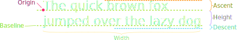

## Announcements
- I'm still working through the PS2 feedback unfortunately
  - It's been a week, and this problem set takes a while to score
- Don't forget that the Wordle Project is posted when you want to get a start on that
  - Please don't wait until late next week to start it
- My availability today is almost non-existant, but I'll be around for 30 min after class or after 5pm
- Visiting Faculty Candidate today!
  - Teaching Demonstration at noon (this room)
  - Research Talk at 1 (this room)
- Polling: [rembold-class.ddns.net](http://rembold-class.ddns.net)

<!--
## Review Question {data-notes="Answer: None of the above, as nothing is returned"}
:::: cols
::: col
When the final line of the code to the right is run, what type of variable is `x`?

:::::{.poll}
#. `integer`{.no-highlight}
#. `float`{.no-highlight}
#. `string`{.no-highlight}
#. None of the above
:::::
:::

::: col
```python
def func(A):
	m = str(A)
	n = m + m + m
	print(n)

y = 5.0
x = func(y)
print(type(x))
```
:::
::::
-->
## Smile!
::::cols
:::col

{width=80%}

:::
:::{.col style="flex-grow:1.5" .fragment}

```python
gw = GWindow(400, 400)

head = GOval(20, 20, 360, 360)
head.set_fill_color("yellow")
head.set_filled(True)
gw.add(head)

reye = GOval(110, 100, 40, 40)
reye.set_filled(True)
gw.add(reye)

leye = GOval(250, 100, 40, 40)
leye.set_filled(True)
gw.add(leye)

mouth = GLine(150, 250, 250, 250)
mouth.set_line_width(5)
gw.add(mouth)
```
:::
::::


## Review Question
Which of the below images would be produced by the following code?
```{.python style='font-size:.8em'}
gw = GWindow(200,200)
for c in range(0,10):
    for r in range(0,10):
        rect = GRect(20*c,20*r,20,20)
        if (r+c) % 2 != 0:
            rect.set_filled(True)
    gw.add(rect)
```

:::cols

::::col
{width=70%}
::::
::::col
{width=70%}
::::
::::col
{width=70%}
::::
::::col
{width=70%}
::::

:::

## Label It!
- Sometimes you need to add some text to the window
- Can display any string using `GLabel` using the following format:
  ```python
  msg = GLabel(string_to_add, x_location, y_location)
  ```
- Here `string_to_add` is the text you want to display, and `x_location` and `y_location` are the (x,y) coordinates of where you want to place the origin of the label.


## Label Geometry
:::{style='font-size:.9em'}
- The `GLabel` class relies on some geometrical concepts that are derived from classical typesetting
	- The _baseline_ is the imaginary line on which the characters rest
	- The _origin_ is the point on the baseline at which the text begins
	- The _width_ is the horizontal distance from the origin to the end of the text
	- The _height_ of the font is the distance between adjacent baselines
	- The _ascent_ is the distance the characters rise above the baseline
	- The _descent_ is the distance the characters drop below the baseline
:::




## Interacting with Labels
:::{style='font-size:.9em'}
- A `GLabel` has several special methods that you can use to interact with it
	- You can use: `get_width()`, `get_height()`, `get_ascent()`, and `get_descent()` methods to obtain the geometric properties
	- You can set a special font for the label using
	
      ```python
      labelname.set_font(font)
      ```
	- Where `font` is a string comprised of the following elements:
		- The _font style_, which is usually blank or `italic`
		- The _font weight_, which is usually blank or `bold`
		- The _font size_, which is a number followed by the units (typically `pt`, `px`, or `em`)
		- The _font family_, which is the name of the font. Because what fonts are available can differ from machine to machine, the family is usually a sequence of fonts separated by commas
		- The font family sequence usually ends with a standard family (`serif`, `sans-serif`, or `monospace`) to ensure that the label can display
:::


## Label Example
```python
gw = GWindow(500, 200)
msg = GLabel("hello world!", 50, 100)
msg.set_font("italic bold 80px 'times new roman'")
gw.add(msg)
```
<br><br>

{width=50%}


## Centering a `GLabel`
:::incremental
- Frequently useful to center within the window or some shape
- To center properly, you need to know the label dimensions, but you can't determine the dimensions until after you've created the label!
- The main idea then is to:
	- Create a `GLabel` without setting its location
	- Call the `.set_font()` method to set the desired font (which could change the size)
	- Determine the horizontal position of the origin by subtracting half the width from the desired location x
	- Determine the vertical position of the baseline by adding half the ascent to the desired location y
	- Add the `GLabel` at the newly calculated position
:::

## Centering Example
```python
gw = GWindow(500, 200)
msg = GLabel("hello world!")
msg.set_font("italic bold 20px 'times new roman'")
x = gw.get_width()  / 2 - msg.get_width()  / 2
y = gw.get_height() / 2 + msg.get_ascent() / 2
gw.add(msg, x, y)
```


## Nondeterministic Programming
- For Wordle, the game is only interesting if the secret word is not the same every time!
- Let's look at the built-in `random` library, which lets us simulate random processes
- Programs that involve random processes that cannot be predicted in advance are said to be _nondeterministic_
- Nondeterministic behavior is essential to many applications. 
	- Many games would not be enjoyable if they behaved the exact same way every playthrough
	- Important practical uses in simulations, computer security, and algorithm research


## Important Functions in `random`

:::{style='font-size: 80%'}

- Random Integers

|                          |                                                             |
| :---                     | :------                                                     |
| `randint(minv, maxv)`    | Returns an integer between minv and maxv, inclusive         |
| `randrange(limit)`       | Returns an integer from 0 up to but not including limit     |
| `randrange(start,limit)` | Returns an integer from start up to but not including limit |
| `random()`            | Returns a random float between 0 and 1       |
| `uniform(minv, maxv)` | Returns a random float between minv and maxv |
| `choice(a_list)`    | Returns a random element from `a_list`       |
| `sample(a_list, k)` | Returns a list of `k` elements from `a_list` |
| `shuffle(a_list)`   | Randomly reorders the elements of `a_list`   |

:::

## Random Examples
```{.python style='max-height:900px'}
import random

def random_redblue():
	if random.random() > 0.5:
		return "red"
	else:
		return "blue"

def random_color():
	color_string = "#"
	for i in range(6):
		color_string += random.choice("0123456789ABCDEF")
	return color
```

## Function Review
- A _function_ is just a sequence of statements that have been collected together and given a name
	- Makes it possible to execute the statements multiple times much more easily
- Some reminders about vocabulary:
	- Invoking or running a function by name is known as **calling** that function.
	- The caller passes information to a function using **arguments**.
	- When a function completes its block of code, it **returns** to its caller.
	- The function gives information back to the caller by **returning a result**
    
```python
def function_name( parameter_list ):
  function_body
```

## Predicate Functions
- Functions that return a Boolean value are called _predicate functions_
  ```python
  def is_divisible_by(x, y):
  	return x % y == 0
  ```
- Once you have defined a predicate function, you can use it in any conditional expression!
  ```python
  for i in range(1, 100):
  	if is_divisible_by(i, 7):
  		print(i)
  ```


## Predicate No-nos
- Don't complicate your code for no reason!
- Work directly with the boolean values when possible
- Try not to code patterns like the following:
  ```{.python .badcode}
  def is_divisible_by(x, y):
  	if x % y == 0:
  		return True
  	else:
  		return False
  ```
  ```{.python .badcode}
  for i in range(1, 100):
  	if is_divisible_by(i,7) == True:
  		print(i)
  ```

## Parameter Purposes
- Often functions need some sort of outside input in order to be useful
- It is necessary for them to know enough details so that they can carry out the requested task, but not so many that the function becomes annoying to use
	- Imagine you were trying to accomplish the task yourself!
	- What is the minimum amount of information you would need to know?
- The minimum necessary information needed for the function to accomplish its task is generally the information conveyed in the parameters
- There is always a balance
	- More parameters makes your function more general, to be used elsewhere
	- More parameters are tedious and potentially error prone to enter if unnecessary


## Jockeying for Position
- So far we have used a positional way to assign arguments to parameters

	```python-repl
	>>> def func( first, second, third ):
			print( first, second, third )
	>>> func(1,2,3)
	1 2 3
	>>> func(2,6,4)
	2 6 4
	```
	- First argument to first parameter, second to second parameter, etc

## The Word is Key
- Arguments may also be specified by a _keyword_, in which the caller precedes the argument with a parameter name and equals sign
- Always stores the argument value in the specified parameter
  ```python-repl
  >>>  def func( first, second, third ):
  		print( first, second, third )
  >>>  func(third=4, first=2, second=6)
  2 6 4
  ```
- Keyword arguments can appear in any order
- **All keyword arguments must come after any positional arguments!**

<!--
## Default Slide Title
- Python allows you to specify a default value for a parameter, which is will use if one is not directly supplied
- Do so by adding an equals sign and a value after the parameter name
  ```python
  def introduction(name='Jed', age=37):
  	print('My name is ', name, ' and I am ', age)
  ```
  - So you define default values when you define the function
- If providing any arguments after a default parameter, you must indicate them through keywords


## Default Example
  ```{.python-repl style="max-height: 800px"}
  >>> introduction()
  My name is Jed and I am 37
  >>> introduction('Bob', 25)
  My name is Bob and I am 25
  >>> introduction('Larry')
  My name is Larry and I am 37
  >>> introduction(age=68)
  My name is Jed and I am 68
  ```


## Returning Graphics
- You can `return` any type of variable from a function, including `GObject` graphical objects
- Can be useful to write simple functions that bundle together common tasks
- For instance, to create a filled circle centered at some location:
  ```python
  def make_filled_circ(x_cent, y_cent, radius, color='black'):
  	circle = GOval(
  				  x_cent-radius, y_cent-radius, 
  				  2*radius, 2*radius
  				  )
  	circle.set_color(color)
  	circle.set_filled(True)
  	return circle
  ```

## Poll!
:::::cols
:::col
```python
def Vegas(x):
	y = 2
	for i in range(5):
		x += y
	return x

x = 3
z = Vegas(x)
print('z =', z)
print('x =', x)
```
:::
:::col
Consider the code to the left. When the final value of `x` is printed, what will its value be?

::::poll
#. 3
#. 5
#. 13
#. `None`{.no-highlight}
::::
:::
:::::


## Stacks and Scopes
- Functions really do work as self-contained little boxes or environments!
	- "What happens in `Vegas` stays in `Vegas`...
- Whenever Python enters a new function, you can envision that it gets out a fresh new board to keep track of that function's variables
	- What happens on that board does NOT affect whatever might have been defined or happened on other boards
	- Each board is commonly called a _stack frame_
- When Python finishes with a function and returns, the board or stack frame for that function is **thrown away**!


## Taking a Walk through Vegas
We'll annotate the stack frames by hand as the earlier code runs:

```{.python data-line-numbers=1-11|1|7|8|2|3|4|3|4|3|4|3|4|3|4|5|9|10 style="max-height:800px"}
def Vegas(x):
	y = 2
	for i in range(5):
		x += y
	return x

x = 3
z = Vegas(x)
print('z =', z)
print('x =', x)
```

## Summary of a Function Call 

:::{.incremental style='font-size:.8em'}
#. Evaluate the arguments in the context of the caller
#. Reserve space for the function in a new stack frame
#. Copy each positional argument to the corresponding parameter variable
#. Copy each keyword argument to the parameter with that name
#. For parameters with default values, if not already assigned, assign those values
#. Evaluate statements in the function body, using current stack frame to look up values of local variables
#. On encountering a `return`, compute the return value and substitute that value in place of the function call
#. Remove the stack frame
#. Return to the caller, continuing from just after the function call
:::

## Understanding Check {data-notes="Answer is 27"}

::::::cols
::::col
Riddle me this. What would be the printed value of z at the end of the code to the right?

:::{.poll}
#. 27
#. 25
#. 19
#. None of the above
:::

::::

::::col
```python
def f(x,y):
	z = (x + 3) ** 2
	return y + z

x = 1
z = x + f(y=x,x=2)
print(z)

```

::::
::::::

## Name Resolution and Scope
- When Python encounters a variable name in a program, it looks for where the variable was defined in an expanding search:
	1. **Local** - The local context is all the variables defined within the current function. This includes variables appearing as a parameter!
	2. **Enclosing** - The enclosing context consists of the names defined in a function enclosing the current one.
	3. **Global** - The global context consists of names defined outside of any function or imported into the current module.
	4. **Built-in** - The last place Python looks is in the names of any built-in functions, like `abs`, `str`, `print`, etc.
- The part of a program in which a name is defined in called its _scope_

## Scoping Example
```{.python style='max-height:900px'}
def func1(x,y):
	return z + func2(x,y)

def func2(x,y):
	def func3(x):
		return (y + x) ** 2

	z = x - func3(y)
	return z - y


z = 1
print(func1(2,z))
```

## Local Variables
- In Python, assigning any value to a variable means that the variable is assumed to be _local_
	- This generally makes sense, as you would not want more specific functions overriding variables in other areas
- Can lead to issues though:
```{.python .badcode}
def increment():
	x = x + 1

x = 0
increment()
```
- There are a few ways to address this, but we'll focus on one in particular when it comes to PGL

-->

<!--

## Libraries and Interfaces
::::cols
:::col
- Modern programming depends on the use of libraries. When writing a program, you usually write only a fraction of the code.
- Libraries can be viewed from two perspectives:
	- Code that uses a library is called a _client_.
	- Code for the library itself is called the _implementation_
- The point where the client and the implementation meet is called the _interface_ and serves as both a barrier and a communication channel
:::
:::col


:::
::::


## Nondeterministic Programming
- Before writing our own library, helps to have more examples than just `math`
- Let's look at the built-in `random` library, which lets us simulate random processes
- Programs that involve random processes that cannot be predicted in advance are said to be _nondeterministic_
- Nondeterministic behavior is essential to many applications. 
	- Many games would not be enjoyable if they behaved the exact same way every playthrough
	- Important practical uses in simulations, computer security, and algorithm research


## Important Functions in `random`

:::{style='font-size: 80%'}

- Random Integers

|                          |                                                             |
| :---                     | :------                                                     |
| `randint(minv, maxv)`    | Returns an integer between minv and maxv, inclusive         |
| `randrange(limit)`       | Returns an integer from 0 up to but not including limit     |
| `randrange(start,limit)` | Returns an integer from start up to but not including limit |

- Random Floats

|                       |                                               |
| :---                  | :---                                          |
| `random()`            | Returns a random number between 0 and 1       |
| `uniform(minv, maxv)` | Returns a random number between minv and maxv |

- Random from lists

|                     |                                              |
| :---                | :---                                         |
| `choice(a_list)`    | Returns a random element from `a_list`       |
| `sample(a_list, k)` | Returns a list of `k` elements from `a_list` |
| `shuffle(a_list)`   | Randomly reorders the elements of `a_list`   |

:::

-->
