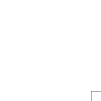
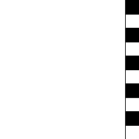
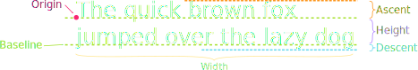
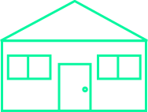

## Announcements
- PS 3 grading is ongoing. I should introduce a new grading pattern from PS 4
	- See me if you have any question regarding PS 2 grading.
- Project 1 is due on **Tuesday next week**
- Please attend your section! Attendance counts for participation 
- Majority of what you need for the project is learned in the section 
- Polling continues today! Remember to use this link [https://www.polleverywhere.com/agbofred203](https://www.polleverywhere.com/agbofred203) when it becomes **active**


## Review Question
Which of the below images would be produced by the following code?
```python
gw = GWindow(200,200)
for c in range(0,10):
    for r in range(0,10):
        rect = GRect(20*c,20*r,20,20)
        if (r+c) % 2 != 0:
            rect.set_filled(True)
    gw.add(rect)
```

:::cols

::::col
{width=80%}
::::
::::col
{width=80%}
::::
::::col
{width=80%}
::::
::::col
{width=80%}
::::

:::


## The `GObject` Hierarchy
- The types of graphical objects form a hierarchy:


- The `GObject` class represents the collection of all graphical objects
- The `GFillableObject` class represents those that have a fillable interior


## Interacting with the `GWindow`
- We've already shown creation:

```python
gw = GWindow(width, height)
```
- You have several more operations that you can apply to the `GWindow` object:

-------------------------------------- -------------------------------------
       `gw.add(object)`{.no-highlight} Adds an object to the window
 `gw.add(object, x, y)`{.no-highlight} Adds an object to the window after moving it to (x,y)
    `gw.remove(object)`{.no-highlight} Removes an object from the window
       `gw.get_width()`{.no-highlight} Returns the width of the graphics window in pixels
      `gw.get_height()`{.no-highlight} Returns the height of the graphics window in pixels
-------------------------------------- -------------------------------------


## Interacting with `GObject`s
- The following operations apply to all GObjects,  where `object`{.no-highlight} is the name of any specific instance.

---------------------------------------- ----------------------------
         `object.get_x()`{.no-highlight} Returns the x coordinate of this object
         `object.get_y()`{.no-highlight} Returns the y coordinate of this object
     `object.get_width()`{.no-highlight} Returns the width of this object
    `object.get_height()`{.no-highlight} Returns the height of this object
`object.set_color(color)`{.no-highlight} Sets the color of the object to the specified color
---------------------------------------- ----------------------------

- All coordinates and distances are measured in pixels


## Interacting with `GFillableObject`s
- Fillable GObjects have a smaller subset of commands that also apply to them.
- Initially the only fillable objects available to you are rectangles and ovals

--------------------------------------------- ----------------------------
     `object.set_filled(bool)`{.no-highlight} Sets the fill state of the object
`object.set_fill_color(color)`{.no-highlight} Sets the color to be used to fill the interior, otherwise same as the outer line
     `object.get_fill_color()`{.no-highlight} Gets the current color used to display the object interior
          `object.is_filled()`{.no-highlight} Returns True or False depending on whether the object is currently filled
--------------------------------------------- ----------------------------

## Smile!
::::cols
:::{.col style="flex-grow:1.5"}

```python
gw = GWindow(400, 400)

head = GOval(20, 20, 360, 360)
head.set_fill_color("yellow")
head.set_filled(True)
gw.add(head)

reye = GOval(110, 100, 40, 40)
reye.set_filled(True)
gw.add(reye)

leye = GOval(250, 100, 40, 40)
leye.set_filled(True)
gw.add(leye)

mouth = GLine(150, 250, 250, 250)
mouth.set_line_width(5)
gw.add(mouth)
```
:::
:::col

{width=80%}

:::
::::

## Label It!
- Sometimes you need to add some text to the window
- Can display any string using `GLabel` using the following format:

```python
msg = GLabel(string_to_add, x_location, y_location)
```
- Here `string_to_add` is the text you want to display, and `x_location` and `y_location` are the (x,y) coordinates of where you want to place the string


## Label Geometry
- The `GLabel` class relies on some geometrical concepts that are derived from classical typesetting
	- The _baseline_ is the imaginary line on which the characters rest
	- The _origin_ is the point on the baseline at which the text begins
	- The _width_ is the horizontal distance from the origin to the end of the text
	- The _height_ of the font is the distance between adjacent baselines
	- The _ascent_ is the distance the characters rise above the baseline
	- The _descent_ is the distance the characters drop below the baseline
<br><br>




## Interacting with Labels
- A `GLabel` has several special methods that you can use to interact with it
	- You can use: `get_width()`, `get_height()`, `get_ascent()`, and `get_descent()` methods to obtain the geometric properties
	- You can set a special font for the label using
	
	```python
	labelname.set_font(font)
	```
	- The font is a string comprised of the following elements:
		- The _font style_, which is usually blank or `italic`
		- The _font weight_, which is usually blank or `bold`
		- The _font size_, which is a number followed by the units (typically `pt`, `px`, or `em`)
		- The _font family_, which is the name of the font. Because what fonts are available can differ from machine to machine, the family is usually a sequence of fonts separated by commas
		- The font family sequence usually ends with a standard family (`serif`, `sans-serif`, or `monospace`) to ensure that the label can display

## Label Example
```python
gw = GWindow(500, 200)
msg = GLabel("hello world!", 50, 100)
msg.set_font("italic bold 80px 'times new roman'")
gw.add(msg)
```
<br><br>

{width=50%}


## Centering a `GLabel`
- Frequently useful to center within the window or some shape
- To center properly, you need to know the label dimensions, but you can't determine the dimensions until after you've created the label!
- The main idea then is to:
	- Create a `GLabel` without setting its location
	- Call the `.set_font()` method to set the desired font (which could change the size)
	- Determine the horizontal position of the origin by subtracting half the width from the desired location x
	- Determine the vertical position of the baseline by adding half the ascent to the desired location y
	- Add the `GLabel` at the newly calculated position


## Centering Example
```python
gw = GWindow(500, 200)
msg = GLabel("hello world!")
msg.set_font("italic bold 20px 'times new roman'")
x = 250 - msg.get_width() / 2
y = 100 + msg.get_ascent() / 2
gw.add(msg, x, y)
```
## Stepwise Refinement
- The most effective way to solve complex problems is to break them down into successively smaller and simpler sub-problems
- Start by breaking the whole task into simpler parts
	- Some of those parts may need more sub-parts
- Entire process is called _stepwise refinement_ or _decomposition_
<!--
\begin{tikzpicture}%%width=70%
	[
	every node/.style={draw, very thick, rounded corners, Green, font=\LARGE\bf, inner sep=2mm}
	]
	\node(a) at (0,0) {Complete Task};
	\node[right = 2cm of a](b2) {Subtask 2};
	\node[above = of b2](b1) {Subtask 1};
	\node[below = of b2](b3) {Subtask 3};
	\node[above right= 3mm and 2cm of b2](c1) {Subsubtask 1};
	\node[below right= 3mm and 2cm of b2](c2) {Subsubtask 2};
	\draw[ultra thick, Blue] (a.east) edge (b1.west) edge (b2.west) edge (b3.west)
		(b2.east) edge (c1.west) edge (c2.west);

\end{tikzpicture}
-->

## Choosing a Decomposition
The proposed steps should be easy to explain.
: One indication that you have succeeded is being able to find simple names.

The steps should be as general as possible.
: Code gets reused all the time in programming. If your functions perform general tasks, they are much easier to reuse.

The steps should make sense at the level of abstraction in which they are used.
: If you have a function or method that does the correct job but whose name doesn't fit or make sense in the contex of the problem, consider defining a new method that calls the old one.


## House Decomposition - try it
How could we think about decomposing the problem of drawing the below house?
<br><br>

