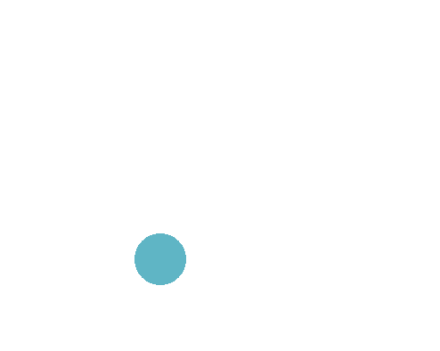

## Announcements
:::{style='font-size:.9em'}
- Welcome back to today's class! 
- Problem set 4 is due on ***October 17 at 12 noon***. That is next week Tuesday!
	- It was available since Monday evening this week
	- Remember! Try not to turn in your submission late to free time for other assignments
    - Attend your sections to get help on the problem set 4
- See me if you have any concerns regarding the midterm
- CS151 Graphics Contest is ongoing and it is due on ***31st October***
    - Instructions on how to make submission is posted on Canvas
    - You are allowed to demonstrate your imaginative and creative skills 
On Friday is holiday. **No Class!**
- Polling continues today! Remember to use this link [https://www.polleverywhere.com/agbofred203](https://www.polleverywhere.com/agbofred203) when it becomes **active**


:::

## Review Question! {data-notes="Solution: Shrinks and then filled"}
::::::cols
::::col
When the function `rev_q` is called, what happens when the mouse is clicked in the window?

:::{.poll}
#. The square shrinks
#. The square gets filled
#. The square shrinks and then gets filled
#. The square gets filled and then shrinks
:::

::::

::::{.col style="flex-grow:2"}
```{.python style="max-height:900px; font-size:.80em; width:100%"}
def rev_q():
    def act_A(e):
        sq.set_filled(True)
    def act_B(e):
        sq.set_size(
			sq.get_width() - 10,
			sq.get_height() - 10
		)
    gw = GWindow(500, 500)
    sq = GRect(200, 200, 100, 100)
    sq.set_color("blue")
    gw.add(sq)
    gw.add_event_listener("mousedown", act_B)
    gw.add_event_listener("click", act_A)
```

::::
::::::


## Fixed Line-Drawing
```{.python style="max-height:800px;" data-line-numbers=""}
from pgl import GWindow, GLine

WIDTH = 500
HEIGHT = 500

def draw_lines():
	def mousedown_event(e):
		x = e.get_x()
		y = e.get_y()
		gw.line = GLine(x,y,x,y)
		gw.add(gw.line)

	def drag_action(e):
		gw.line.set_end_point(e.get_x(), e.get_y())

	gw = GWindow(WIDTH, HEIGHT)
	gw.line = None
	gw.add_event_listener("mousedown", mousedown_event)
	gw.add_event_listener("drag", drag_action)

if __name__ == '__main__':
	draw_lines()
```


## Timer Events
- Previously we looked at how our programs could react to mouse events
- Can also listen for _timer events_, which occur after a specific time interval
- You specify the listener for a timer event in the form of a callback function that is invoked at the end of the time interval
- Can add animation to our graphics by creating a timer whose callback makes small updates to the graphical objects in the window
	- If the time interval is short enough (usually sub 30 milliseconds), the animations will appear smooth to the human eye


## Timer Types
- PGL supports two kinds of timers:
	- A _one-shot timer_ invokes its callback **only once** after a specified delay
		- Created with

		  ```python
		  gw.set_timeout(function, delay)
		  ```
	- An _interval timer_ invokes its callback function **repeatedly** at regular intervals
		- Created with

			```python
			gw.set_interval(function, delay)
			```
	- In both, `function` is the callback function and `delay` is the time interval in milliseconds
- Both methods return a `GTimer` object that identifies the timer, and can be stopped by invoking the `.stop()` method on that timer


## Moving Square
```{.python style="max-height:900px"}
def moving_square():
    def step():
		square.move(dx, dy)
		if square.get_x() > 500:
			timer.stop()

	gw = GWindow(500, 200)
	dx = 1
	dy = 0
	square = create_filled_rect(12, 100, 24, 24, "red")
	gw.add(square)
	timer = gw.set_interval(step, 20)
```


## Growing Circles
{width=50%}


## Waiting vs Events
- Many would probably try to approach this doing something like as follows:
  ```python
  def growing_circles():
  	gw = GWindow(WIDTH, HEIGHT)
  	for i in range(NUM_CIRCLES):
  		# Create a new circle
  		# Animate the circle to grow it
  		# Wait for the animation to complete
  ```
- The problem here is that there is no clear way to "wait" for an animation to complete
	- Code you write runs basically instantly or when run by a callback
- Instead need an event callback that takes care of both circle creation (when needed) and growing animations


## Using Events Wisely
- Need to keep track of what the program **should** be doing, and then have the timer callback function handle whatever is needed
- Conceptually, for these circles, might look more like this:
```python
def step():
	if """ there is a circle still growing """
		"""then increase its size """
	elif """ a new circle needs to be created """
		""" then create one """
	else:
		timer.stop()
```


## Making those circles grow!
```{.python style='max-height:800px;' data-line-numbers=""}
from pgl import GWindow, GOval
import random

GWIDTH = 500
GHEIGHT = 400
N_CIRCLES = 20
MIN_RADIUS = 15
MAX_RADIUS = 100
DELTA_TIME = 10
DELTA_SIZE = 1

def random_color():
	color = "#"
	for i in range(6):
		color += random.choice("0123456789ABCDEF")
	return color

def create_filled_circle(x, y, r, color="black"):
	circ = Goval(x-r, y-r, 2*r, 2*r)
	circ.set_filled(True)
	circ.set_color(color)
	return circ

def growing_circles():
    def start_new_circle():
        r = random.uniform(MIN_RADIUS, MAX_RADIUS)
        x = random.uniform(r, GWIDTH - r)
        y = random.uniform(r, GHEIGHT - r)
        gw.circle = create_filled_circle(
							x, y, 
							0, random_color()
						)
        gw.desired_size = 2 * r
        gw.current_size = 0
        gw.circles_created += 1
        return gw.circle

    def step():
		# Grow a circle if needed
        if gw.current_size < gw.desired_size:
            gw.current_size += DELTA_SIZE
            x = gw.circle.get_x() - DELTA_SIZE / 2
            y = gw.circle.get_y() - DELTA_SIZE / 2
            gw.circle.set_bounds(
							x, y, 
							gw.current_size,
							gw.current_size
						)
		# or add a circle if you can
        elif gw.circles_created < N_CIRCLES:
            gw.add(start_new_circle())
		# or stop
        else:
            timer.stop()

    gw = GWindow(GWIDTH, GHEIGHT)
    gw.circles_created = 0
    gw.current_size = 0
    gw.desired_size = 0
    timer = gw.set_interval(step, DELTA_TIME)
```

## Simulation
- Our technique of piecing together many small movements to resemble motion is not limited to just making pretty animations!
- Physicists use similar techniques to break complex problems into simple pieces
	- "In this small time interval, the motion is simple"
	- Chain together many time intervals to construct the full motion
- There are many areas where this is the **only** way to solve a problem, as we can not write down equations to express the result otherwise!

## The Two Body Problem
```{.python style="max-height:800px;"}
from pgl import GWindow, GOval, GLine
from pgl_tools import create_filled_circle

def two_body():
    def step():
        # Compute forces and accelerations
        dx = planet1.get_x() - planet2.get_x()
        dy = planet1.get_y() - planet2.get_y()
        r3 = (dx ** 2 + dy ** 2) ** (3 / 2)
        ax = 1000 / r3 * dx
        ay = 1000 / r3 * dy

        # Update velocities
        gw.vx1 += -ax
        gw.vy1 += -ay
        gw.vx2 += ax
        gw.vy2 += ay

        # Augment history paths
        path1 = GLine(
            planet1.get_x() + 10,
            planet1.get_y() + 10,
            planet1.get_x() + 10 + gw.vx1,
            planet1.get_y() + 10 + gw.vy1,
        )
        path1.set_color("red")
        path1.set_line_width(3)

        path2 = GLine(
            planet2.get_x() + 10,
            planet2.get_y() + 10,
            planet2.get_x() + 10 + gw.vx2,
            planet2.get_y() + 10 + gw.vy2,
        )
        path2.set_color("cyan")
        path2.set_line_width(3)

        # Move planets
        planet1.move(gw.vx1, gw.vy1)
        planet2.move(gw.vx2, gw.vy2)

        gw.add(path1)
        gw.add(path2)

    gw = GWindow(600, 600)
    # Defining state variables
    gw.vx1, gw.vy1 = 0, 1
    gw.vx2, gw.vy2 = 0, -1

    planet1 = create_filled_circle(200, 200, 10, "red")
    planet2 = create_filled_circle(400, 200, 10, "cyan")

    gw.add(planet1)
    gw.add(planet2)

    gw.set_interval(step, 30)

if __name__ == '__main__':
    two_body()
```

## Something to smile about

::::::cols
::::{.col style='font-size:.9em'}
<!--- Up until now, we haven't had a way to draw an arc!-->
- The `GArc` class represents an arc formed by taking a section of the perimeter of an oval.
- 3 things necessary:
	- The bounding rectangle geometry (upper left corner and width and height)
	- The _starting angle_ (in degrees)
	- The _sweep angle_ (in degrees) which is how far the arc extends
- Negative angles move in the clockwise direction
::::

::::col

\begin{tikzpicture}%%width=100%
\draw[MPurple] (-2,0) -- (2,0) (0,-2) -- (0,2);
\draw[dashed, MBlue] (-1.5,-1.5) rectangle (1.5, 1.5);
\draw[ultra thick, MRed, line cap=round] (45:1.5) arc (45:270:1.5);

\draw[MOrange, dashed] (0,0) -- (45:1.5);
\draw[MOrange, thick, -stealth] (0:1) arc (0:45:1) node[midway,right,font=\scriptsize\sf] {start};

\draw[MGreen, thick, -stealth] (45:0.5) arc (45:270:0.5) node[midway, left, font=\scriptsize\sf] {sweep};
\end{tikzpicture}

::::
::::::


## Fillable Arcs
- The `GArc` class is a `GFillableObject`, and so you can call `.set_filled()` on a `GArc` object
- Filled like a pie-shaped wedge formed between the center of the bounding box and the starting and end points of the arc

::::::cols
::::col
```python
def filled_arc():
    gw = GWindow(400, 400)
    arc = GArc(50, 50, 
			   350, 350, 
			   90, 135)
    arc.set_color("orange")
    arc.set_filled(True)
    gw.add(arc)
```
::::

::::col
{width=50%}
::::
::::::
