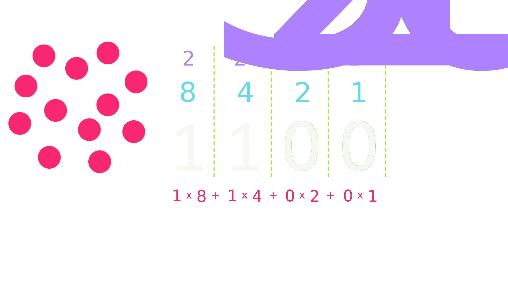

## Announcements
- PS3 feedback coming later today
- I'm shooting for PS4 feedback by Wednesday
- Midterm on Friday!
    - First practice exam already out
    - Second practice exam to be posted later today
    - Learning objective checklist posted. Look it over as you study!
    - **I'm not going to put timer events or complex shapes on the midterm since you have not completed an assignment with those ideas**
        - Mouse events are fair game though
- Polling: [rembold-class.ddns.net](http://rembold-class.ddns.net)

## Review Question
::::::cols
::::col
Which of the below blocks of code will create the image to the right? The window measures 500 x 200 pixels and the value of `d` is 150.
::::

::::col
{width=65%}
::::
::::::

::::::cols
::::col

:::{.block name="A"}
```{.python style='font-size:.8em; margin-left:1em;'}
x, y = 250 - d / 2, 100 - d / 2
a1 = GArc(x, y, d, d, 90, -180)
gw.add(a1)
```
:::

:::{.block name="C"}
```{.python style='font-size:.8em; margin-left:1em;'}
x, y = 250 - d, 100 - d
a1 = GArc(x, y, d, d, -180, 90)
gw.add(a1)
```
:::

::::

::::col
:::{.block name="B"}
```{.python style='font-size:.8em; margin-left:1em;'}
x, y = 250 - d / 2, 100 - d / 2
a1 = GArc(x, y, d, d, 90, 180)
gw.add(a1)
```
:::

:::{.block name="D"}
```{.python style='font-size:.8em; margin-left:1em;'}
x, y = 250 - d / 2, 100 - d / 2
a1 = GArc(x, y, d, 180, -90)
gw.add(a1)
```
:::

::::
::::::


## Triangle By Vertex
```{.python style='max-height:800px;'}
def triangle_by_vertex():
    def create_triangle(b, h):
        tri = GPolygon()
        tri.add_vertex(-b / 2, h / 2)
        tri.add_vertex(b / 2, h / 2)
        tri.add_vertex(0, -h / 2)
        return tri

    gw = GWindow(500, 500)
    triangle = create_triangle(200, 200)
    triangle.set_filled(True)
    triangle.set_color("red")
    gw.add(triangle, 250, 250)
```

## Triangle by Polar Edge
```{.python style='max-height:800px;'}
def triangle_by_polar_edge():
    def create_eq_triangle(side):
        tri = GPolygon()
        tri.add_vertex(0, 0)
        for i in range(0, 360, 120):
            tri.add_polar_edge(side, i)
        return tri

    gw = GWindow(500, 500)
    triangle = create_eq_triangle(100)
    triangle.set_filled(True)
    triangle.set_color("green")
    gw.add(triangle, 250, 250)
```

## Compound Objects
- The `GCompound` class makes it possible to combine several graphical objects so that the entire structure behaves as a single object
- Can be thought of as a combination of `GWindow` and `GObject`
	- You can add objects to it, but then you can also add it (and everything in it) to a window as one single object
        - This can be necessary to animate complex objects!
- Like a `GPolygon`, uses its own coordinate system relative to a reference point
	- When adding objects to the `GCompound`, you place them relative to the reference point
	- When adding the `GCompound` to a canvas, you set the location of the reference point


## And my Axe!
```{.python style='max-height:800px;'}
def my_axe():
    def create_axe():
        axe = GCompound()
        shaft = GRect(-15, 0, 30, 300)
        shaft.set_filled(True)
        shaft.set_color("brown")
        axe.add(shaft)

        blade = GPolygon()
        blade.add_vertex(0, 0)
        blade.add_vertex(200, -50)
        blade.add_vertex(200, 50)
        blade.set_filled(True)
        blade.set_color("gray")
        axe.add(blade, -80, 50)
        return axe

    gw = GWindow(500, 500)
    axe = create_axe()
    gw.add(axe, 250, 100)
```


## Project 2: Breakout!

::::::{.cols style='align-items:center'}
::::col
- Project 2 is recreating the classic arcade game Breakout!
- Guide will be posted tomorrow, not due until March 10
- Focus on the midterm initially, but then consider getting a start this weekend
::::

::::col

<iframe width='100%' height='400vh' src="https://www.youtube.com/embed/UhAEjDKEHgk" title="Data Driven Gamer: Breakout (Atari, 1976 arcade, 60fps)" frameborder="0" allow="accelerometer; autoplay; clipboard-write; encrypted-media; gyroscope; picture-in-picture" allowfullscreen></iframe>
<iframe width="100%" height="400vh" src="https://www.youtube.com/embed/QrlIqaN4ltM" title="DX Ball 2 gameplay (PC Game, 1999)" frameborder="0" allow="accelerometer; autoplay; clipboard-write; encrypted-media; gyroscope; picture-in-picture" allowfullscreen></iframe>
::::
::::::

## Breakout History
> - The popular Breakout arcade game was released by Atari in 1976
> - Atari founder Nolan Bushnell wanted a new game that would build on the success of the earlier game Pong. He assigned Steve Jobs to develop the game, promising a bonus if the game required a small number of chips.
> - As Wikipedia tells the story, "Jobs had little specialized knowledge of circuit board design but knew [his friend Steve] Wozniak was capable of producing designs with a small number of chips. He convinced Wozniak to work with him, promising to split the fee evenly between them."
> - Wozniak completed the game design in four days, but Jobs never told him about the bonus offer. Jobs was paid $\$5,000$, but Wozniak received only $\$350$.
> - Jobs and Wozniak co-founded Apple Computer the following year, which has grown to be the largest corporation in the world by market capitalization.


## Breakout Basics
::::::{.cols style='align-items: center'}
::::{.col style='font-size:.9em'}
- Breakout is a game in which the player attempts to break all the colored bricks by causing a bouncing ball to collide with them
- The player controls a paddle at the bottom of the screen which the ball will bounce off
    - The paddle can only move left and right
- If the ball makes it past the paddle to the bottom of the screen, the player loses a life
    - Lose 3 lives and it is game over!
::::

::::col

{width=50%}

::::
::::::

## Breakout Milestones
- Breakout is broken up over 5 milestones
- You have already seen or written pieces of similar code to many of the milestones!
    - Milestone 1: PS4 brick pyramid
    - Milestone 3: Section bouncy ball problem (this week)


## Milestone 1

<iframe width='60%' height='800px' src="https://willamette.edu/~esroberts/cs151/Assignments/Project2/Breakout1/index.html"></iframe>


## Milestone 2

<iframe width='60%' height='800px' src="https://willamette.edu/~esroberts/cs151/Assignments/Project2/Breakout2/index.html"></iframe>


## Milestone 3

<iframe width='60%' height='800px' src="https://willamette.edu/~esroberts/cs151/Assignments/Project2/Breakout3/index.html"></iframe>


## Milestone 4

<iframe width='60%' height='800px' src="https://willamette.edu/~esroberts/cs151/Assignments/Project2/Breakout4/index.html"></iframe>


## Milestone 5

<iframe width='60%' height='800px' src="https://willamette.edu/~esroberts/cs151/Assignments/Project2/Breakout5/index.html"></iframe>


## Representations
- For the remained of today, we want to focus on how a computer can internally store more complex and abstract information
- Initially will look at numbers
- Then we'll segue into strings

## Bit Power
- The fundamental unit of memory inside a computer is called a _bit_
	- Coined from a contraction of the words binary and digit
- An individual bit exists in one of two states, usually denoted as **0** or **1**.
- More complex data can be represented by combining larger numbers of bits:
	- Two bits can represent 4 ($2\times 2$) values
	- Three bits can represent 8 ($2\times2\times2$) values
	- Four bits can represent 16 ($2\times2\times2\times2$ or $2^4$) values, etc
- My laptop here has 16GB of system memory, and can therefore keep track of approximately $2^{16,000,000,000}$ states!


## An old code, but it checks out
::::::cols
::::col
- Binary notation is an old idea
	- Described by German mathematician Leibniz back in 1703
- Leibniz describes his use of binary notation in an easy to follow style
- Leibniz's paper notes that the Chinese had discovered binary arithmetic 2000 years earlier, as illustrated by the patterns of lines in the _I Ching_!
::::

::::col
{width=70%}
::::
::::::

## Back to Grade school
:::center

:::

## Now in Binary
:::center

:::

## Representing Integers
- The number of symbols available to count with determines the _base_ of a number system
	- Decimal is base 10, as we have 10 symbols (0-9) to count with
		- Each new number counts for 10 times as much as the previous
	- Binary is base 2, as we only have 2 symbols (0 and 1) to count with
		- Each new number counts for twice as much as the previous
- Can always determine what number a representation corresponds to by adding up the individual contributions

<br>
\begin{tikzpicture}%%width=50%
[
every node/.style={draw, thick, MGreen, font=\Large}
]
\node(1) at (0,0) {0};
\node[right=0cm of 1](1) {0};
\node[right=0cm of 1](1) {1};
\node[right=0cm of 1](1) {0};
\node[right=0cm of 1](1) {1};
\node[right=0cm of 1](1) {0};
\node[right=0cm of 1](1) {1};
\node[right=0cm of 1](1) {0};
\end{tikzpicture}
