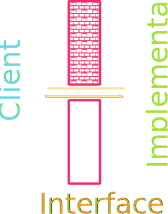

<!--
## Understanding Check {data-notes="Answer is 50"}
::::cols
:::col
What would be the final printed value of `c` in the code to the right?

:::::poll
#. -15
#. 20
#. 50
#. None of the above
:::::

:::
:::col
```{.python style='max-height:900px'}
def f(a, b=5, c=True):
	if c:
		return a + b
	else:
		return a * b

def g(c):
	for i in range(2):
		c+=b
	return c > b

a = -3
b = 2
c = f(10, c=g(a))
print(c)
```
:::
::::

## Libraries and Interfaces
::::cols
:::{.col style="flex-grow:1.5"}
- Modern programming depends on the use of libraries. 
	- You usually write only a fraction of the code.
- Libraries can be viewed from two perspectives:
	- Code that uses a library is called a _client_.
	- Code for the library itself is called the _implementation_
- The point where the client and the implementation meet is called the _interface_
	- Serves as both a barrier and a communication channel
:::
:::col



:::
::::


## Nondeterministic Programming
- Before writing our own library, helps to have more examples than just `math`
- Let's look at the built-in `random` library, which lets us simulate random processes
- Programs that involve random processes that cannot be predicted in advance are said to be _nondeterministic_
- Nondeterministic behavior is essential to many applications. 
	- Many games would not be enjoyable if they behaved the exact same way every playthrough
	- Important practical uses in simulations, computer security, and algorithm research


## Important Functions in `random`

:::{style='font-size: 80%'}

- Random Integers

|                          |                                                             |
| :---                     | :------                                                     |
| `randint(minv, maxv)`    | Returns an integer between minv and maxv, inclusive         |
| `randrange(limit)`       | Returns an integer from 0 up to but not including limit     |
| `randrange(start,limit)` | Returns an integer from start up to but not including limit |
| `random()`            | Returns a random float between 0 and 1       |
| `uniform(minv, maxv)` | Returns a random float between minv and maxv |
| `choice(a_list)`    | Returns a random element from `a_list`       |
| `sample(a_list, k)` | Returns a list of `k` elements from `a_list` |
| `shuffle(a_list)`   | Randomly reorders the elements of `a_list`   |

:::

## Random Examples
```{.python style='max-height:900px'}
import random

def random_redblue():
	if random.random() > 0.5:
		return "red"
	else:
		return "blue"

def random_color():
	color_string = "#"
	for i in range(6):
		color_string += random.choice("0123456789ABCDEF")
	return color
```

## Quite the Reader
- You can `return` any type of variable from a function, including `GObject` graphical objects
- Can be useful to write simple functions that bundle together common tasks
- Can create our own Python library by constructing a collection of constants or functions
- All code not in functions gets executed as soon as we `import` so generally don't want extraneous print statements or to be running any code directly
- Want the library to be in the same location as any code we want to `import` the library in


## PGL Help Library
```{.python style='max-height:800px; font-size:0.75em;'}
from pgl import GRect, GLabel
import random

def create_filled_rect(
	x_cent, y_cent, width, height, fill_col='black', border_col=None
):
	"""
	Creates a GRect object with the desired fill color. 
	If a border color is specified, also draws the 
	border in the desired color.
	"""
	rect = GRect(x_cent-width/2, y_cent-height/2, width, height)
	rect.set_filled(True)
	if border_col is None:
		rect.set_color(fill_col)
	else:
		rect.set_color(border_col)
		rect.set_fill_color(fill_col)
	return rect

def random_color():
	"""
	Returns a random opaque color as a hex string.
	"""
	color = "#"
	for i in range(6):
		color += random.choice("0123456789ABCDEF")
	return color

def create_centered_label(x_cent, y_cent, text, font=None):
	"""
	Creates a GLabel object and centers it on the coordinates
	x_cent and y_cent.
	"""
	label = GLabel(text)
	if font is not None:
		label.set_font(font)
	label.set_location(x_cent - label.get_width() / 2, 
					   y_cent + label.get_ascent() / 2 )
	return label
```
-->

<!--
## {data-background-iframe="https://www.youtube.com/embed/TIxt9guMbXo"}
<!---

## New Graphics Methods
:::{style='font-size:.9em'}
- A new method that acts on a `GWindow`:

 |
:---|:----
`get_element_at(x,y)`{.no-highlight} | Returns the frontmost object at (x,y) or `None`

- And more new methods that act on any `GObject`

   | 
  :---|:-------
  `set_location(x,y)`{.no-highlight} | Resets the location of the object to the specified point
  `move(dx,dy)`{.no-highlight} | Moves the object `dx` and `dy` pixels from its current position
  `move_polar(dr,theta)`{.no-highlight} | Moves the object `dr` pixel units in direction `theta`
  `contains(x,y)`{.no-highlight} | Returns `True` if the object contains the specified point
  `get_color()`{.no-highlight} | Returns the color currently assigned to the object

:::

## The Python Event Model
- Graphical applications usually make it possible for the user to control the action of a program by using an input device such a mouse.
	- Programs supporting this type of control are called _interactive programs_.
- User actions such as clicking the mouse are called _events_.
- Programs that respond to events are said to be _event driven_.
- User input does not generally occur at predictable times. As the events are not controlled by the program, they are said to be _asynchronous_.
- In Python, you write a function that acts as a _listener_ for a particular event type. When the event happens, the listener is called.


## First Class Functions
- Functions in Python are treated as data values just like anything else!
	- We will need to take advantage of this to write listener functions.
- You can assign a function to a variable, pass it as a parameter, return it as a result, etc
- Functions treated like any other data value are called _first-class functions_
- To work with a function itself, you leave off the `()`. Including the parentheses is how you _call_ the function!


## A First Class Example
```python
import math

def evaluate_numbers(func):
	print(func)
	print(func(0))
	print(func(2))
	print(func(10))

evaluate_numbers(math.sqrt)
evaluate_numbers(math.exp)
```
<!---
## Closures
::::cols
:::col
Consider the code to the right. 

::::: incremental
- Why does the line 12 not error?
- [Python Tutor](http://www.pythontutor.com/visualize.html#code=b%20%3D%201%0Adef%20f1%28a%29%3A%0A%20%20%20%20print%28a%29%0A%20%20%20%20print%28b%29%0A%20%20%20%20def%20f2%28%29%3A%0A%20%20%20%20%20%20%20%20c%20%3D%20a%20%2B%20b%0A%20%20%20%20%20%20%20%20return%20c%20*%203%0A%20%20%20%20return%20f2%20%0Af2%20%3D%20f1%2810%29%0Ac%20%3D%20f2%28%29&cumulative=false&curInstr=0&heapPrimitives=false&mode=display&origin=opt-frontend.js&py=3&rawInputLstJSON=%5B%5D&textReferences=false)
- `f2` must also keep track of any local variables!
- The local variables that are included as part of a function are called its _closure_
:::::

:::
:::col
```{.python style='max-height:800px' data-line-numbers=''}
b = 1
def f1(a):
    print(a)
	print(b)

	def f2():
		c = a + b
		return c * 3
	return f2 

f2 = f1(10) 
c = f2()
```
:::
::::


## Our First Interactive Example
:::{style='font-size:.9em'}
- Consider the simple program below, where we've imported the basics and some of our helper functions
  ```python
  def draw_dots():
      def click_action(event):
          c = create_filled_rect(
              event.get_x(), event.get_y(), 
              10,10, random_color())
          gw.add(c)
  
      gw = GWindow(500, 500)
      gw.add_event_listener("click", click_action)
  ```
- The `click_action` function specifies what to do when the mouse is clicked
	- Note that it has access to the `gw` variable since it is in the enclosing function and thus in the closure.
:::

## Registering a Listener
- The last line of our example function:

	```python
	gw.add_event_listener("click", click_action)
	```
	tells the graphics window (`gw`) to call the `click_action` function whenever a mouse "click" occurs within the window.
- When the user clicks the mouse, the graphics window, in essense, calls the client back to let them know that a click has occured. Thus, functions such as `click_action` are known as _callback functions_.
- The parameter `event` given to the callback function is a special data structure called a _mouse event_, which contains details about the specifics of the event that triggered the action.


## Mouse Events
- We have a fairly comprehensive list of mouse-events that we can trigger callbacks on:

| Name | Description
---:|:-----
`"click"` | The user clicks the mouse in the window
`"dblclk"` | The user double-clicks the mouse in the window
`"mousedown"` | The user presses the mouse button down
`"mouseup"` | The user releases the mouse button
`"mousemove"` | The user moves the mouse
`"drag"` | The user moves the mouse with the button down

## Event Details
- Certain actions can trigger more than one event
	- Clicking generates a "mousedown", "mouseup", and then "click" event, in that order
- Events trigger no action unless the window is listening for that event
	- If I drag my mouse in the `draw_dots()` function, you'll notice that nothing happens
- You can setup however many listeners you feel you need in order to make your program behave as desired
```python
gw.add_event_listener("click", click_action)
gw.add_event_listener("dblclk", dblclk_action)
```

## Line Drawing
- Say we wanted to write a simple program that allows the user to draw lines by clicking and dragging the mouse
- Using two event listeners would be useful:
	- "mousedown" could start drawing a zero-length line at the current mouse position (and add it to the window)
	- "drag" could update the end-point of that line
- The strategy would allow the user to have visual feedback as they drag around, helping them to position the line
	- Since the line stretches and contracts as you move the cursor around, the technique is commonly called _rubber-banding_

