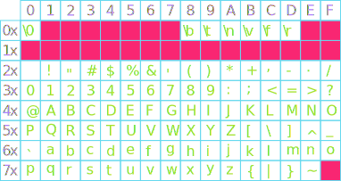

## Announcements
- Problem set 3 is posted already and due **next week Tuesday at 12:noon**
- I would recommend you turn in your weekly solution ***as is*** on **due date** to avoid being overloaded in the following week.
- This week's lecture introduces concepts you would need for the first project coming up next week 
- Sections this week on working with strings
- Remember to seek help from your section leaders to resolve any problem or QUAD Center
- Polling continues today! Remember to use this link [https://www.polleverywhere.com/agbofred203](https://www.polleverywhere.com/agbofred203) when it becomes **active**

## Review! {data-notes="Solution: 00101000"}
How would you represent the number
$$28_{16}$$
in binary?

:::{.poll}
#. $01101101_2$
#. $10101010_2$
#. $00111010_2$
#. $00101000_2$
:::

<!--
## Representation
- Sequences of bits have no intrinsic meaning!
	- Just the representations we assign to them by convention or by building certain operations into hardware
	- A 32-bit sequence represents an integer only because we have designed hardware to manipulate those sequences arithmetically: applying operations like addition, subtraction, etc
- By choosing an appropriate representation, you can use bits to represent any value you could imagine!
	- Characters represented by numeric character codes
	- Floating-point representations to support real numbers
	- Two-dimensional arrays of bits representing images
	- Sequences of images representing video, etc
- To be useful though, everyone needs to agree on a representation!
## Representation Pitfalls
::::::cols
::::col
```python
A = 1
B = 0
for i in range(10):
	B += 0.1
print(A == B)
```
::::
::::{.col style='flex-grow:1.25'}
- The left code will print out `False`!
- Python represents floating point (fractional) numbers using two integers
	- One to represent the significant digits
	- One to represent the exponent
::::
::::::
- $1\frac{1}{4}$ Example
	- In decimal:
		$\quad\displaystyle 1\frac{1}{4} = \frac{1}{1} + \frac{2}{10} + \frac{5}{100} = 1.25 = (125, -2)$
	- In binary:
		$\quad\displaystyle 1\frac{1}{4} = \frac{1}{1} + \frac{0}{2} + \frac{1}{4} = 1.01 = (101, -10)$


## Floating Binary
:::incremental
- Say we wanted to convert the value $\tfrac{7}{8}$ to a binary floating point representation:
	$$\frac{7}{8} = \frac{0}{1} + \frac{1}{2} + \frac{1}{4} + \frac{1}{8} = 0.111 = (111, -11)$$
- Now how would we convert $\frac{1}{10}$ to binary??
	- We run into a problem! An infinitely repeating sequence!
	$$\frac{1}{10} = \frac{0}{1} + \frac{0}{2} + \frac{0}{8} + \frac{1}{16} + \frac{1}{32} + \frac{0}{64} + \frac{0}{128} + \frac{1}{256} +  \cdots = 0.0001100110011\ldots$$ 
	- Have to stop the sequence somewhere and approximate it:
		$$\frac{3}{32} = 0.09375\quad\text{or}\quad\frac{25}{256} = 0.09765625$$
- Note that we have the same issues in decimal, writing out ratios like $\frac{1}{3}$
:::

## Consequences
- Most languages end up taking the first 53 significant digits
	$$\frac{3602879701896397}{2^{55}} = 0.10000000000000000555111512312578270$$
- When doing operations on these numbers, extra decimals will sometimes get rounded off, suddenly making the number look precise, but you might always have a tiny bit of this rounding error showing up in floating point values.
- So be _careful_ using `==` for numeric comparisons! Rounding might result in unexpected falsehoods
	- Far better to check if two numbers are within a small margin of one another, or greater or less than the other
- Errors will usually average out over being a bit too large or two small
	- Repeated calculation of some types can sometimes accumulate errors in the same direction and cause more of an issue
-->

## Revisiting Other Data Types (STRING)
- Numbers are great, but what about other types of data?
- We briefly touched string data type in earlier class but let us revisit it in more details 
- Note! other data type you would see later include:
	- lists!


## Strings
- A _string_ in Python represents textual data, in form of a sequence of individual characters
	- Domain: all possible sequences of characters
	- Operations: **Many!** We'll see some of them soon
- Denoted by placing the desired sequence of characters between two quotation marks
	- `'I am a string'`
	- In Python, either single or double quotes can be used, but the ends must match
		- `"I am also a string!"`
		- `"I'm sad you've gone"`

<!--
## Lists
- A _list_ in Python represents a sequence of **any** type of data
- Denote by bordering with square brackets (`[`, `]`) with commas separating each element of the sequence
	- Each element could be any data type (even mixing from element to element!)
	- `['This', 'is', 'a', 'list']`
	- `['Great', 4, 'storing', 5 * 10]`
- There are many operations that we will see are possible on lists, but will start with only the basics
-->

## Sequences
- Both _strings_ and _lists_ are examples of a more general type called a _sequence_
	- Strings are sequences of characters
	- Lists are sequences of anything
- Sequences are _ordered_, so we can number off their elements, which we call their _index_
	- Counting in Python always starts with **0**, so the first element of the sequence has index 0
- Python defines operations that work on all sequences
	- Selecting an individual element out of a sequence
	- Concatenating two sequences together
	- Determing the number of elements in a sequence

## Selection
- You can select or "pluck out" just a single element from a sequence using square brackets `[` `]`
	- There are **no** commas between these square brackets, so they can't be confused with a list
	- The square brackets come after the sequence (or variable name representing a sequence)
	- Inside the square brackets, you place the index number of the element you want to select

:::::cols
::::{.col .fragment}
```python
>>> A = [2, 4, 6, 8]
>>> print(A[1])
4
```
::::
::::{.col .fragment}
```python
>>> B = "Spaghetti"
>>> print(B[6])
't'
```
::::
:::::

## Concatenation
- _Concatenation_ is the act of taking two separate objects and bringing them together to create a single object
- For sequences, concatenation takes the contents of one sequence and add them to the end of another sequence
- The `+` operator concatenates sequences
	- This is why it is important to keep track of your variable types! `+` will **add** two integers, but will **concatenate** two strings
  
  :::::cols
  ::::{.col .fragment}
  ```python
  >>> 'fish' + 'sticks'
  'fishsticks'
  ```
  ::::
  ::::{.col .fragment}
  ```python
  >>> A = [1, 'fish']
  >>> B = [2, 'fish']
  >>> print(A + B)
  [1, 'fish', 2, 'fish']
  ```
  ::::
  :::::

## Lengths
- The number of elements in a sequence is commonly called its _length_, and can be given by the `len( )` function
- Simply place the sequence you desire to know the length of between the parentheses:

  ```python
  >>> len("spaghetti")
  9
  ```
- You can have sequences of 0 length as well!
  
  ```python
  >>> A = ""
  >>> B = [ ]
  >>> print( len(A) + len(B) )
  0
  ```

## Representing Characters
- We use numeric encodings to represent character data inside the machine, where each character is assigned an integer value.
- Character codes are not very useful unless standardized though!
	- Competing encodings in the early years made it difficult to share data across machines
- First widely adopted character encoding was ASCII (American Standard Code for Information Interchange)
- Originally just with 128 possible characters, even after expanding to 256, ASCII proved inadequate in the international world, and has therefore been superseded by Unicode.

## ASCII

{width=100%}


## Meeting `chr` and `ord`
- Python includes two build in functions to simplify conversion between an integer and the corresponding Unicode character
- `chr` takes a base-10 integer and returns the corresponding Unicode character as a string
	- `chr(65)` gives `"A"` (capital A)
	- `chr(960)` gives `"π"` (Greek letter pi)
- `ord` goes the other direction, taking a single character string and returning the corresponding base-10 integer of that character in Unicode
	- `ord("B")` gives 66
	- `ord(" ")` gives 32
	- `ord("π")` gives 960

## Abstract Strings
- Characters (and their Unicode representation) are most often used in programming when combined to make collections of consecutive characters called _strings_.
- Internally, strings are stored as a sequence of characters in a sequential chunk of memory.
- You don't have to (and generally don't want to) think of the internal representation.
	- Better to think of the string as a single abstract unit
- Python emphasizes this abstract view by defining a built-in string class that already defines a selection of higher-level operations on string objects

## Character Picking Recap
- A string is an _ordered_ collection of characters
	- Character positions in the string are identified by an _index_, which **starts at 0**

\begin{tikzpicture}%%width=70%
[
block/.style={draw, thick, MGreen, font=\tt\LARGE, minimum size=1cm}
]
\foreach[count=\i from 0] \x in {s,p,a,g,h,e,t,t,i, ,s,a,u,c,e}{
	\node[block, baseline=0](char) at (\i, 0) {$\strut$\x};
	\node[below=0cm of char, MBlue,anchor=north, font=\large] {\i};
}
\end{tikzpicture}

- You can select individual characters from the string using the syntax

	```python
	string[k]
	```

	where `string` is the variable assigned to the desired string and `k` is the index integer of the character you want
```{.python-repl style='font-size:.7em'}
>>> print("spaghetti sauce"[5])
e
```

## Back it Up
- Sometimes it is more useful to count from the end of the string, not the beginning
- Python gives you a convenient way to do this, using negative indexes

<br>

\begin{tikzpicture}%%width=70%
[
block/.style={draw, thick, MGreen, font=\tt\LARGE, minimum size=1cm}
]
\foreach[count=\x from 0, evaluate=\x as \i using {int(15-\x)}] \s in {s,p,a,g,h,e,t,t,i, ,s,a,u,c,e}{
	\node[block,baseline=0](char) at (\x, 0) {$\strut$\s};
	\node[below=0cm of char, MBlue,anchor=north, font=\large] {-\i};
}
\end{tikzpicture}

- A common use case is to grab the last character of the string, using

	```python
	s[-1]
	```
	which is shorthand for

	```python
	s[len(s)-1]
	```

## Slicing
- Often, you may want more than a single character
- Python allows you to specify a starting and an ending index through an operation known as _slicing_
- The syntax looks like:

	```python
	string_variable[start : limit]
	```
  where `start` is the first index to be included and everything up to but **not including** the `limit` is included
- `start` and `limit` are actually optional (but the `:` is not)
	- If `start` omitted, the slice will begin at the start of the string
	- If `limit` omitted, the slice will proceed to the end of the string


## and Dicing
- Can add a third component to the slice syntax, called a _stride_
  ```python
  string_variable[start : limit : stride]
  ```
- Specifies how large the steps are between each included index
- Can also make the stride negative to proceed backwards through a string
  ```python-repl
  >>> s = "spaghetti sauce"
  >>> s[4:8]
  hett
  >>> s[10:]
  sauce
  >>> s[:10:2]
  sahti
  ```

## Repeat again?
- We've already seen how we can use addition (`+`) in Python to concatenate strings
- In math, adding something many times is the same as multiplying

$$5+5+5+5+5+5 = 6 \times 5$$

- The same logic holds true for Python strings!
	- You multiply by a **integer**: the number of times you want the concatenation repeated
	- You can not multiply two strings together, Python will not understand what you are trying to do
```python
print("Betelguese, " * 3)
```

## Comparing Strings
- Python lets you use normal comparison operators to compare  strings

	```python
	string1 == string2
	```
	is true if `string1` and `string2` contain the same characters in the same order
- Comparisons involving greater than or less than are done similar to alphabetical ordering
	- Start at the beginning and compare a character. If they are the same, then compare the next character, etc
- All comparisons are done **according to their Unicode values**.
	- Called _lexicographic ordering_
	- `"cat" > "CAT"`


## Can't change a string's colors
- Strings are what we call _immutable_: they can not be modified in place by clients.
- You can "look" at different parts of the string, but you can not "change" those parts without making a whole new string
  ```{.python .badcode}
  s = "Cats!"
  s[0] = "R"   # THIS WILL ERROR!!
  ```
- You can of course create a new string object with the desired traits:
  ```python
  s = "R" + s[1:]
  ```
- This applies to all methods that act on strings as well: they return a **new** string, they do not modify the original


## Methods to find string patterns

:::{style='font-size:.9em'}

Method | Description
--- | -----
`string.find(pattern)` | Returns the first index of `pattern` in `string`, or `-1` if it does not appear
`string.find(pattern, k)` | Same as the one-argument version, but starts searching at index `k`
`string.rfind(pattern)` | Returns the last index of `pattern` is `string`, or `-1` if missing
`string.rfind(pattern, k)` | Same as the one-argument version, but searches backwards from index `k`
`string.startswith(prefix)` | Returns `True` if the string starts with `prefix`
`string.endswith(suffix)` | Returns `True` if the string ends with `suffix`

:::

## Transforming Methods
:::{style='font-size:.9em'}

Method | Description
---|----
`string.lower()` | Returns a copy of `string` with all letters converted to lowercase
`string.upper()` | Returns a copy of `string` with all letters converted to uppercase
`string.capitalize()` | Returns a copy of `string` with the first character capitalized and the rest lowercase
`string.strip()` | Returns a copy of `string` with whitespace and non-printing characters removed from both ends
`string.replace(old, new)` | Returns a copy of `string` with all instances of `old` replaced by `new`
:::

## Classifying Character Methods
:::{style='font-size:.9em'}

Method | Description
--- | -----
`char.isalpha()` | Returns `True` if `char` is a letter
`char.isdigit()` | Returns `True` if `char` is a digit
`char.isalnum()` | Returns `True` if `char` is letter or a digit
`char.islower()` | Returns `True` if `char` is a lowercase letter
`char.isupper()` | Returns `True` if `char` is an uppercase letter
`char.isspace()` | Returns `True` if `char` is a whitespace character (space, tab, or newline)
`char.isidentifier()` | Returns `True` if `char` is a legal Python identifier
:::


## Igpay Atinlay
- Suppose we wanted to write a script that converted English to Pig Latin
- Rules of Pig Latin:
	- If the word begins with a consonant, move everything up to the first vowel to the end and append on "ay" at the end
	<center>
		`fleet` ⟶  `eetflay`
	</center>
	- If the word starts with a vowel, just append "way" to the end
	<center>
		`orange` ⟶  `orangeway`
	</center>
	- If the word has no vowels, do nothing
- Our decomposition:
	- Find first vowel
    - Convert a single word

## Indingfay Owelsvay
```python
def find_first_vowel_index(word):
	"""
	Find the first vowel in a word and return its index,
	or return None if no vowels found.
	"""
    for i in range(len(word)):
        index = "aeiou".find(word[i].lower())
        if index != -1:
            return i
    return None
```

## Onvertcay Oneway Ordway
```{.python style='max-height:900px;'}
def word_2_pig_latin(word):
	"""
	Convert a single word with no special characters from
	English to Pig Latin.
	"""
    vowel = find_first_vowel_index(word)
    if vowel is None:
        return word
    elif vowel == 0:
        return word + "way"
    else:
        return word[vowel:] + word[:vowel] + "ay"
```
