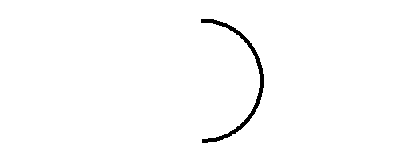

## Announcements
- Project 2: Breakout is posted and due **next week Tuesday at noon!**
- Problem Set 4 grading is ongoing
- Section Leaders are working on Project 1 feedback
- Note the change in lecture hall on Friday this week. 
    - **Lecture holds at Smullin B17**
- Remember! CS151 Graphics Contest is ongoing and it is due on ***31st October***
- CS/DS Tea tomorrow at 11:30 in Ford 101 (Digital Learning Studio)
	- There will be a special talk by ***Dr. Rachel Brown*** from Lewis & Clark
- Polling continues today! Remember to use this link [https://www.polleverywhere.com/agbofred203](https://www.polleverywhere.com/agbofred203) when it becomes **active**


<!--
## Review Question {data-notes="Solution: C, as it has the wrong data types for x and y"}
All the functions below would print out all valid two letter words from the English language *at least once* except for 1. Which does not?

::::::cols
::::col
:::{.block name="A"}
```{.python style='font-size:.85em'}
def func_A():
for word in ENGLISH_WORDS:
	if len(word) == 2:
		print(word)
```
:::

:::{.block name="C"}
```{.python style='font-size:.85em'}
alphabet = "abcdefghijklmnopqrstuvwxyz"
def func_C():
	for x in range(len(alphabet))
		for y in alphabet:
			word = x + alphabet[y]
			if is_english_word(word)
				print(word)
```
:::
::::

::::col
:::{.block name="B"}
```{.python style='font-size:.85em'}
def func_B():
for word in ENGLISH_WORDS:
	if is_english_word(word[:2]):
		print(word[:2])
```
:::

:::{.block name="D"}
```{.python style='font-size:.85em'}
alphabet = "abcdefghijklmnopqrstuvwxyz"
def func_D():
	for l1 in alphabet:
		for l2 in alphabet:
			word = l1 + l2
			if is_english_word(word)
				print(word)
```
:::

::::
::::::
-->

## Project 2: Breakout!

::::::{.cols style='align-items:center'}
::::col
- Project 2 is recreating the classic arcade game Breakout!
- Guide will be posted tomorrow, not due until March 10
- Focus on the midterm initially, but then consider getting a start this weekend
::::

::::col

<iframe width='100%' height='400vh' src="https://www.youtube.com/embed/UhAEjDKEHgk" title="Data Driven Gamer: Breakout (Atari, 1976 arcade, 60fps)" frameborder="0" allow="accelerometer; autoplay; clipboard-write; encrypted-media; gyroscope; picture-in-picture" allowfullscreen></iframe>
<iframe width="100%" height="400vh" src="https://www.youtube.com/embed/QrlIqaN4ltM" title="DX Ball 2 gameplay (PC Game, 1999)" frameborder="0" allow="accelerometer; autoplay; clipboard-write; encrypted-media; gyroscope; picture-in-picture" allowfullscreen></iframe>
::::
::::::

## Breakout History
> - The popular Breakout arcade game was released by Atari in 1976
> - Atari founder Nolan Bushnell wanted a new game that would build on the success of the earlier game Pong. He assigned Steve Jobs to develop the game, promising a bonus if the game required a small number of chips.
> - As Wikipedia tells the story, "Jobs had little specialized knowledge of circuit board design but knew [his friend Steve] Wozniak was capable of producing designs with a small number of chips. He convinced Wozniak to work with him, promising to split the fee evenly between them."
> - Wozniak completed the game design in four days, but Jobs never told him about the bonus offer. Jobs was paid $\$5,000$, but Wozniak received only $\$350$.
> - Jobs and Wozniak co-founded Apple Computer the following year, which has grown to be the largest corporation in the world by market capitalization.


## Breakout Basics
::::::{.cols style='align-items: center'}
::::{.col style='font-size:.9em'}
- Breakout is a game in which the player attempts to break all the colored bricks by causing a bouncing ball to collide with them
- The player controls a paddle at the bottom of the screen which the ball will bounce off
    - The paddle can only move left and right
- If the ball makes it past the paddle to the bottom of the screen, the player loses a life
    - Lose 3 lives and it is game over!
::::

::::col

{width=50%}

::::
::::::

## Breakout Milestones
- Breakout is broken up over 5 milestones
- You have already seen or written pieces of similar code to many of the milestones!
    - Milestone 1: PS4 brick pyramid
    - Milestone 3: Section bouncy ball problem (this week)


## Milestone 1

<iframe width='60%' height='800px' src="https://willamette.edu/~esroberts/cs151/Assignments/Project2/Breakout1/index.html"></iframe>


## Milestone 2

<iframe width='60%' height='800px' src="https://willamette.edu/~esroberts/cs151/Assignments/Project2/Breakout2/index.html"></iframe>


## Milestone 3

<iframe width='60%' height='800px' src="https://willamette.edu/~esroberts/cs151/Assignments/Project2/Breakout3/index.html"></iframe>


## Milestone 4

<iframe width='60%' height='800px' src="https://willamette.edu/~esroberts/cs151/Assignments/Project2/Breakout4/index.html"></iframe>


## Milestone 5

<iframe width='60%' height='800px' src="https://willamette.edu/~esroberts/cs151/Assignments/Project2/Breakout5/index.html"></iframe>


## Review Question {data-note="Solution is A"}
::::::cols
::::col
Which of the below blocks of code will create the image to the right? The window measures 500 x 200 pixels and the value of `d` is 150.
::::

::::col
{width=65%}
::::
::::::

::::::cols
::::col

:::{.block name="A"}
```{.python style='font-size:.8em; margin-left:1em;'}
x, y = 250 - d / 2, 100 - d / 2
a1 = GArc(x, y, d, d, 90, -180)
gw.add(a1)
```
:::

:::{.block name="C"}
```{.python style='font-size:.8em; margin-left:1em;'}
x, y = 250 - d, 100 - d
a1 = GArc(x, y, d, d, -180, 90)
gw.add(a1)
```
:::

::::

::::col
:::{.block name="B"}
```{.python style='font-size:.8em; margin-left:1em;'}
x, y = 250 - d / 2, 100 - d / 2
a1 = GArc(x, y, d, d, 90, 180)
gw.add(a1)
```
:::

:::{.block name="D"}
```{.python style='font-size:.8em; margin-left:1em;'}
x, y = 250 - d / 2, 100 - d / 2
a1 = GArc(x, y, d, 180, -90)
gw.add(a1)
```
:::

::::
::::::

## Arrays and Lists
- From the earliest days, programming languages have supported the idea of an _array_, or an ordered sequence of values.
- Individual values in an array are called _elements_, and the number of elements is the _length_ of the array.
- Each element's position in the array is given by its _index_, with index numbers starting at 0 and extending up to 1 less than the length of the array
- Python implements the array concept in a bit more general form called a _list_.


## Reminder: Making Lists
- Created using square brackets with elements separated by commas:
  ```python
  COIN_VALUES = [1, 5, 10, 25, 50, 100]
  COIN_NAMES = [ "penny", "nickle", "dime",
                 "quarter", "half-dollar", "dollar" ]
  ```
- Lists are commonly represented visually or conceptually as a series of numbered boxes:
\begin{tikzpicture}%%width=80%
[box/.style={draw, thick, MBlue, minimum width=2cm, minimum height=1cm, font=\tt, text width=2cm, align=center}]
\node[box, label={[MPurple,font=\footnotesize]below:0}](0) at (0,0) {1};
\node[box, label={[MPurple,font=\footnotesize]below:1}, right=0cm of 0](1) {5};
\node[box, label={[MPurple,font=\footnotesize]below:2}, right=0cm of 1](2) {10};
\node[box, label={[MPurple,font=\footnotesize]below:3}, right=0cm of 2](3) {25};
\node[box, label={[MPurple,font=\footnotesize]below:4}, right=0cm of 3](4) {50};
\node[box, label={[MPurple,font=\footnotesize]below:5}, right=0cm of 4](5) {100};
\node[anchor=south west, font=\tt\footnotesize, color=MGreen] at (0.north west) {COIN\_VALUES};
\node[box, label={[MPurple,font=\footnotesize]below:0}](0) at (0,-2) {"penny"};
\node[box, label={[MPurple,font=\footnotesize]below:1}, right=0cm of 0](1) {"nickel"};
\node[box, label={[MPurple,font=\footnotesize]below:2}, right=0cm of 1](2) {"dime"};
\node[box, label={[MPurple,font=\footnotesize]below:3}, right=0cm of 2](3) {"quarter"};
\node[box, label={[MPurple,font=\footnotesize]below:4}, right=0cm of 3](4) {"half-\\dollar"};
\node[box, label={[MPurple,font=\footnotesize]below:5}, right=0cm of 4](5) {"dollar"};
\node[anchor=south west, font=\tt\footnotesize, color=MGreen] at (0.north west) {COIN\_NAMES};
\end{tikzpicture}


## What we already know
- Can retrieve the value of any element in a list by writing the index of that element in square brackets after the list name
	- `COIN_VALUES[3]` ⟶ `25`
	- `COIN_NAMES[2]` ⟶ `"dime"`
- Can concatenate two lists to form a new list with elements from both
    - `[1,2,3] + [4,5,6]`⟶  `[1,2,3,4,5,6]`

- Can loop through each of the list elements in turn
  ```python
  for elem in my_list:
  	# do stuff with elem
  ```
  where `elem` is the name of the variable that will sequentially get assigned the value of every element in `my_list`

## Sequences
- Sound familiar? Lists are just like more general strings!
- Strings and lists are examples of a more general class of object in Python called _sequences_

::::::cols
::::col
:::{.block name=Old}
- We already knew that all sequences support:
  - The `len` function
  - Index numbering starting at 0
  - Concatenation using `+` or `+=`
  - Selection of an individual element using square brackets
  - Looping over elements
:::
::::

::::col
:::{.block name=New .fragment}
- We can now add:
  - Negative index numbering counting backwards from the end 
  - Slicing in all forms
  - Comparing sequences
  - Repetition using `*`
  - Inclusion testing using `in` operator
:::
::::
::::::
<!--
## Understanding Check! {data-notes="Solution: None of the above, as it errors"}
What would the below expression evaluate to?

<center>
<code>["One", 2, True][-1:1:-1][1]</code>
</center>

:::{.poll}
#. `"n"`
#. `2`
#. `True`
#. None of the above, or this will error
:::
-->
## Mutants
- The most important difference between strings and lists is one of _mutability_
	- Strings we have already identified as being _immutable_: you can not change the individual elements
	- Lists, in contrast, are _mutable_, which means that we **can** change or assign new values to the elements of a list
- Immutable objects have many advantages in programming:
	- You don't have to worry about if the values will change
	- Immutable values can be more easily shared
	- Immutable objects are easier to use with concurrent programs
- In some situations though, mutable objects are the perfect tool for the job

## A Tutorial on Lists
::::::cols
::::col
- Thinking about mutable objects requires a shift in how we visualize our code interacting with the objects in memory
- [Link here](https://pythontutor.com/render.html#code=cool%20%3D%20%5B'blue',%20'violet'%5D%0Awarm%20%3D%20%5B'red',%20'orange'%5D%0A%0Acolors%20%3D%20%5Bcool,%20warm%5D%0Aother_colors%20%3D%20%5B%5B'blue',%20'violet'%5D,%0A%20%20%20%20%20%20%20%20%20%20%20%20%20%20%20%20%5B'red',%20'orange'%5D%5D%0A%0Aprint%28colors%20%3D%3D%20other_colors%29%0Aprint%28colors%20is%20other_colors%29%0A%0Acool%5B0%5D%20%3D%20'indigo'%0Awarm%20%3D%20%5B'orange',%20'yellow'%5D%0A%0Aprint%28colors%29%0Aprint%28other_colors%29&cumulative=false&curInstr=0&heapPrimitives=false&mode=display&origin=opt-frontend.js&py=3&rawInputLstJSON=%5B%5D&textReferences=false)
::::

::::{.col style="flex-grow:2;"}
```{.python style='max-height:900px; font-size:0.8em;'}
cool = ['blue', 'violet']
warm = ['red', 'orange']

colors = [cool, warm]
other_colors = [['blue', 'violet'],
				['red', 'orange']]

print(colors == other_colors)
print(colors is other_colors)

cool[0] = 'indigo'
warm = ['orange', 'yellow']

print(colors)
print(other_colors)
```
::::
::::::

## For Reference
- When working with mutable objects, it is better to think of the variable as holding a _reference_ to the object, rather than the actual contents of the object
- I find it useful to think of a reference as the "address" in memory where that object's contents can be found
- This undeniably complicates things, as referencing a mutable object lets you change it, which will immediately be reflected in anything _else_ that referenced that object
- Mutable objects can be terrific to work with, as their mutability makes them very flexible, but be wary of unexpected behavior


## Lists as Arguments
- When you pass a list as an argument to a function or return a list as a result, only the **reference** to the list is actually passed back and forth
- This means that the elements of the list are effectively shared between the function and the caller
	- Changes that the function makes to the elements **will** persist after the function returns
- Example of reversing a list in PythonTutor: [here](http://www.pythontutor.com/visualize.html#code=def%20reverse_in_place%28array%29%3A%0A%20%20%20%20for%20lh%20in%20range%28len%28array%29//2%29%3A%0A%20%20%20%20%20%20%20%20rh%20%3D%20len%28array%29%20-%20lh%20-%201%0A%20%20%20%20%20%20%20%20array%5Blh%5D,%20array%5Brh%5D%20%3D%20array%5Brh%5D,%20array%5Blh%5D%0A%0Aarray%20%3D%20%5B0,%201,%202,%203,%204,%205,%206,%207,%208,%209%5D%0Aprint%28f%22Forward%3A%20%7Barray%7D%22%29%0Areverse_in_place%28array%29%0Aprint%28f%22Reverse%3A%20%7Barray%7D%22%29&cumulative=false&curInstr=0&heapPrimitives=false&mode=display&origin=opt-frontend.js&py=3&rawInputLstJSON=%5B%5D&textReferences=false)


## Sneaky Mutability
- List's mutability can frequently be very nice to work with, but as with lists as arguments to functions, you need to be careful in some instances to ensure you understand how Python is treating the list
- One could encountered a few other problems where it can be easy to mess up:
	- Initializing a list to look like another list, wanting to make changes and then compare it to the original
		- [Example](http://www.pythontutor.com/visualize.html#code=A%20%3D%20%5B'Aardvark',%20'Butterfly',%20'Centipede'%5D%0AB%20%3D%20A%0A%0AB.append%28'Deer'%29%0AB.remove%28'Butterfly'%29%0A%0Aprint%28A%29%0Aprint%28B%29&cumulative=false&curInstr=0&heapPrimitives=false&mode=display&origin=opt-frontend.js&py=3&rawInputLstJSON=%5B%5D&textReferences=false)
	- Looping over a mutating list
		- [Example](http://www.pythontutor.com/visualize.html#code=A%20%3D%20%5B1,2,3,4,5,6,7,8,9%5D%0A%0Afor%20i%20in%20range%28len%28A%29%29%3A%0A%20%20%20%20print%28'Current%20index%3A%20%7B%7D,%20Current%20value%3A%20%7B%7D'.format%28i,A%5Bi%5D%29%29%0A%20%20%20%20if%203%20%3C%20A%5Bi%5D%20%3C%206%3A%0A%20%20%20%20%20%20%20%20A.remove%28A%5Bi%5D%29%0A%20%20%20%0Aprint%28A%29&cumulative=false&curInstr=0&heapPrimitives=false&mode=display&origin=opt-frontend.js&py=3&rawInputLstJSON=%5B%5D&textReferences=false)


## Cloning
- What can we do in these sorts of instances to not let mutability trip us up?
- _Clone_ the list instead of just assigning a reference
	- Creates a **new** object in memory
- Several ways you can make a shallow clone (in code)
	- Using the `.copy()` list method
	- Any slice always returns a new object
	- Using the `list()` function will return a new object


## Common Useful List Methods

Method | Description
---- | ------
`list.copy()` | Returns a new list whose elements are the same as the original
`list.append(value)` | Adds `value` to the end of the list
`list.insert(idx, val)` | Inserts `val` before the specified `idx`
`list.remove(value)` | Removes the first instance of `value` from the list, or errors
`list.reverse()` | Reverses the order of the elements in the list
`list.sort()` | Sorts the elements of the list. Can take an optional argument `key` to specify how to sort


## List building with loops
- Commonly will make lists with a simple:

	```python
	even_digits = [ 2, 4, 6, 8 ]
	```
- But in many cases, it is easier to specify the elements of a list using a sequence of values generated by a `for` loop. For instance

	```python
	even_digits = [ ]
	for i in range(0, 10, 2):
		even_digits.append(i)
	```
- Python gives us a shorthand notation to achieve this:

	```python
	even_digits = [ i for i in range(0, 10, 2) ]
	```
	- Called _list comprehension_


## Comprehending Lists
- The simplest list comprehension syntax is:
	
	```python
	[ expression iterator ]
	```
	where `expression` is any Python expression and `iterator` is a `for` loop header
- The iterator component can be followed by any number of additional modifiers
	- More `for` loop headers for nested loops
	- or `if` statements to select specific values
- Example: all even numbers to 20 not also visible by 3

	```python
	[i for i in range(0,20,2) if i % 3 != 0]
	```
