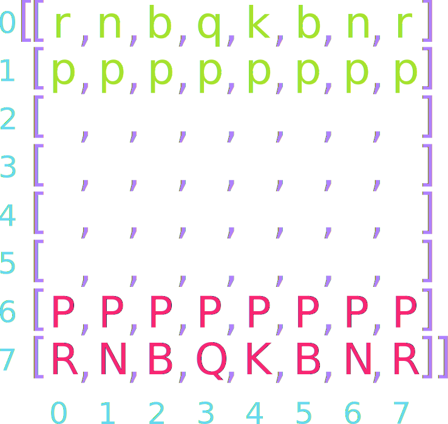

## Announcements
- Problem Set 5 released!
	- Not due until _next_ week Tuesday at 12 noon
- Feedback from Problem 1 out? Hopefully, grade reports to be updated soon.
- Take not of the last day to withdraw
- Polling continues today! Use this link [https://www.polleverywhere.com/agbofred203](https://www.polleverywhere.com/agbofred203)


## Review! {data-notes="Solution: ',,,,'"}
What is the third element (index 2) in the below list?

`[i * 4 for i in "Oct 21, 2022" if not i.isalpha() and not i.isspace()]`{style="display: block; margin: auto; text-align: left; width: 2000px;"}

<br>

:::{.poll}
#. `21`
#. `",,,,"`
#. `"tttt"`
#. `"2222"`
:::
<!--
## Multidimensional Arrays
- We know that elements of a list can be lists in and of themselves. If the lengths of all the lists making up the elements of a list remain fixed, then the list of lists is called a _multidimensional array_
- In Python, we can create multidimensional arrays just by creating lists of constant length as the elements to another list
  ```python
  magic = [ [2, 9, 4], [7, 5, 3], [6, 1, 8] ]
  ```
- We can always get the individual element of one of the inner lists by using **2** indices.
	- `magic[1][1] = 5`
	- `magic[-1][0] = 6`
-->

## Picturing Multidimensional Arrays
- Multidimensional arrays are commonly pictured as each inner list being stacked beneath the previous
- In such a representation, the outermost/first elements/indices represent the row, and the inner/second elements/indices represent the column

`[ [2, 9, 4], [7, 5, 3], [6, 1, 8] ]`{style="display: block; margin: auto; text-align: center;"}

<br>

\begin{tikzpicture}%%width=80%
[
block/.style = {draw, MGreen, outer sep=0pt, font=\Large, minimum size=1cm},
]
\node[block](00) at (0,0) {2};
\node[block,below=0 of 00](10) {7};
\node[block,below=0 of 10](20) {6};

\node[block,right=0 of 00](01) {9};
\node[block,right=0 of 10](11) {5};
\node[block,right=0 of 20](21) {1};

\node[block,right=0 of 01](02) {4};
\node[block,right=0 of 11](12) {3};
\node[block,right=0 of 21](22) {8};


\node[block,color=MBlue,font=\tt,](00) at (5,0) {magic[0][0]};
\node[block,color=MBlue,font=\tt,below=0 of 00](10) {magic[1][0]};
\node[block,color=MBlue,font=\tt,below=0 of 10](20) {magic[2][0]};

\node[block,color=MBlue,font=\tt,right=0 of 00](01) {magic[0][1]};
\node[block,color=MBlue,font=\tt,right=0 of 10](11) {magic[1][1]};
\node[block,color=MBlue,font=\tt,right=0 of 20](21) {magic[2][1]};

\node[block,color=MBlue,font=\tt,right=0 of 01](02) {magic[0][2]};
\node[block,color=MBlue,font=\tt,right=0 of 11](12) {magic[1][2]};
\node[block,color=MBlue,font=\tt,right=0 of 21](22) {magic[2][2]};
\end{tikzpicture}


## Initialize a Chessboard {data-transition="slide-in fade-out" data-transition-speed="slow"}
{data-id="test" data-auto-animate-easing=ease-out}

## Initialize a Chessboard{data-transition="fade-in fade-out" data-transition-speed="slow"}
{data-id="test"}

## Initialize a Chessboard{data-transition="fade-in slide-out" data-transition-speed="slow"}
{data-id="test"}


## The `GImage` Class
- You can display an image from a file in PGL using the `GImage` class.
`GImage(filename, x, y)`{.inlinecode}
	- `filename` is the string containing the name of the file which contains the image
	- `x` and `y` are the coordinates of the upper left corner of the image
- Best to use one of the common image formats
	- Graphical Interchange Format (GIF): `fish.gif`
	- Joint Photographic Experts Group (JPEG): `fish.jpg`
	- Portable Network Graphics (PNG): `fish.png`


## Images and Copyrights
- Most images that you might find on the web are protected by copyright under international law.
- Ensure you have the necessary permissions before using an image
	- On the web, the image hosting site will often specify what rules apply to that image
		- Example: Images from `www.nasa.gov` can be freely used as long as you add an attribution line
	- Non-commercial use of an image can sometimes fall under "fair use" doctrine, but academic integrity and common courtesy both demand you cite or acknowledge any material you have obtained from others.


## Example: VLA Moonset
```{.python style='max-height: 800px; font-size:.7em;'}
from pgl import GImage, GWindow, GLabel

def image_example():
	gw = GWindow(800, 550)
	image = GImage("VLA_Moonset.jpg")
	image.scale(gw.get_width() / image.get_width())
	gw.add(image)

	citation = GLabel("Image Credit: Jeff Hellermann, NRAO / AUI / NSF")
	citation.set_font("15px 'Sans-Serif'")
	x = gw.get_width() - citation.get_width() - 10
	y = image.get_height() + citation.get_ascent()
	gw.add(citation, x, y)
```


## 2D Arrays → Images
- Image data is commonly stored in two-dimensional arrays
- Each element stores information about the pixel that exists at that location
- The `GImage` class lets you convert between the image itself and the array representing the image contents by using the `get_pixel_array` method, which returns a two-dimensional array of integers.
- We could get the pixels from our example image using:
  ```python
  image = GImage("VLA_Moonset.jpg")
  pixels = image.get_pixel_array()
  ```
- The first index of the pixel array gets you the row, the second index gets you the column


## Pixel Contents
- Each element in a pixel array is an integer in which the 32 bits are interpreted as:

\begin{tikzpicture}%%width=90%
[
box/.style={draw, very thick, outer sep=0pt}
]

\node[box, MPurple, text=white, font=\tt, label={[MPurple,font=\large\em]below:transparency}] (alpha) at (0,0) {1 1 1 1 1 1 1 1};
\node[box, MRed,  text=white, font=\tt, label={[MRed,font=\large\em]below: red}, right = 1mm of alpha] (red) {1 0 0 1 0 1 0 1};
\node[box, MGreen, text=white, font=\tt, label={[MGreen,font=\large\em]below: green}, right = 1mm of red] (green) {0 0 1 1 1 0 0 1};
\node[box, MBlue, text=white, font=\tt, label={[MBlue,font=\large\em]below: blue}, right = 1mm of green] (blue) {0 1 1 0 0 0 1 1};
\end{tikzpicture}

- The first byte (8 bits) is the transparency or alpha
- The next three bytes indicate the amount of red, green, and blue in the pixel, where each value varies from 0 to 255
	- Form the RGB of a color, generally expressed in hexadecimal form
		- `10010101` → `0x95`
		- `00111001` → `0x39`
		- `01100011` → `0x63`
	- Overall color: `#953963`{.no-highlight} or <svg width="100" height="50" style="display:inline-block; vertical-align:middle"><rect width="100" height="50" style="fill:#953963"></rect></svg>


## Combining Light Colors

{width=60%}


## Transparency
- The first byte (8 bits) of the pixel value gives the transparency, which indicates how much of the background is allowed to show through
- Often denoted with the Greek letter alpha: $\alpha$
- Varies from 0 to 255 like the other 8 bit values:
	- 0 is entirely transparent
	- 255 is entirely opaque


## Breaking out the Colors
- You do not need to convert the pixel values yourself! PGL has built-in ways to extract the various colors

:::{style="font-size:.8em;"}

Function | Description
--- | -----
`GImage.get_red(pixel)` | Returns the integer (0-255) corresponding to the red portion of the pixel
`GImage.get_green(pixel)` | Returns the integer (0-255) corresponding to the green portion of the pixel
`GImage.get_blue(pixel)` | Returns the integer (0-255) corresponding to the blue portion of the pixel
`GImage.get_alpha(pixel)` | Returns the integer (0-255) corresponding to the alpha portion of the pixel
`GImage.create_rgb_pixel(r,g,b)` | Returns a 32-bit integer corresponding to the desired color

:::

## Reading
- Programs often need to work with collections of data that are too large to reasonably exist typed all out in the code
	- Easier to read in the values of a list from some external data file
- A _file_ is the generic name for any named collection of data maintained on some permanent storage media attached to a computer
- Files can contain information encoded in many different ways
	- Most common is the _text file_
	- Contains character data like you'd find in a string


## Strings vs Text Files
- While strings and text files both store characters, there are some important differences:
	- **The longevity of the data stored**
		- The value of a string variable lasts only as long as the string exists, is not overridden, or is not thrown out when a function completes
		- Information in a text file exists until the file is deleted
	- **How data is read in**
		- You have access to all the characters in a string variable pretty much immediately
		- Data from text files is generally read in sequentially, starting from the beginning and proceeding until the end of the file is reached

## Reading Text Files
- The general approach for reading a text file is to first _open_ the file and associate that file with a variable, commonly called its _file handle_
- We will also use the _with_ keyword to ensure that Python cleans up after itself (closes the file) when we are done with it (Many of us could use a `with` irl)
  ```python
  with open(filename) as file_handle:
  	# Code to read the file using the file_handle
  ```
- Python gives you several ways to actually read in the data
	- `read` reads the entire file in as a string
	- `readline` or `readlines` reads a single line or lines from the file
	- `read` alongside `splitlines` gets you a list of line strings
	- Can use the file handle as an iterator to loop over

## Entire file ⟶ String
- The `read` method reads the entire file into a string, with includes newline characters (`\n`) to mark the end of lines
- Simple, but can be cumbersome to work with the newline characters, and, for large files, it can take a large amount of memory

- As an example, the file:<br><br>

  :::{.block name="Seuss.txt" style='width:40%; margin-left: auto; margin-right: auto;'}
	One fish<br>
	two fish<br>
	red fish<br>
	blue fish
  :::

  would get read as

`"One fish\ntwo fish\nred fish\nblue fish"`{style="display: block; margin: auto; text-align: center;"}

## Line by Line
- Of the ways to read the file in a string at a time, using the file handler as an iterator and looping is probably best and certainly most flexible
- Leads to code that looks like:
  ```python
  with open(filename) as f:
	  for line in f:
		  # Do something with the line
  ```
- Note that **most** strategies preserve the newline character, which you very likely do not want, so be ready to strip them out before doing more processing


## Powers Combined
- So long as your files are not gigantic, using `read` and then the `splitlines` method can be a good option
- This **does** remove the newline characters, since it splits the string at them
  ```python
  with open(filename) as f:
	  lines = f.read().splitlines()
  # Then you can do whatever you want with the list of lines
  ```

## Example: Name Mangling
- Let's look at an example with some more meat to it
- I have a text file with all your first names. I'd like to:
	- Read in the names
	- Select two at random
	- Combine the first half of one name with the second half of the other
	- Print out both potential hybrid names
- We'll practice breaking a problem into steps along the way here


## Example Code:
```{.python style='font-size:.6em; max-height:800px; width=100%;'}
import random

def name_mangler(filename):
    """
    Reads from a roster of first names and then randomly chooses two to cut in half
    and recombine with the other. Then prints off both combinations.

    Inputs:
        filename (string): The filename containing the names

    Outputs:
        None
    """

    def get_names(filename):
        """Reads in the roster. """
        with open(filename) as fh:
            names = fh.read().splitlines()
        return names

    def choose_two(name_list):
        """ Chooses two different names from the list. """
        name1 = random.choice(name_list)
        name2 = random.choice(name_list)
        while name1 == name2:
            name2 = random.choice(name_list)
        return [name1, name2]

    def slice_and_combine(name1, name2):
        """ Slices and recombines both names, printing to the screen. """
        name1_mid = len(name1)//2
        name2_mid = len(name2)//2
        print(name1[:name1_mid] + name2[name2_mid:])
        print(name2[:name2_mid] + name1[name1_mid:])

    names = get_names(filename)
    chosen = choose_two(names)
    slice_and_combine(chosen[0], chosen[1])

if __name__ == '__main__':
    name_mangler('class_first_names.csv')
```