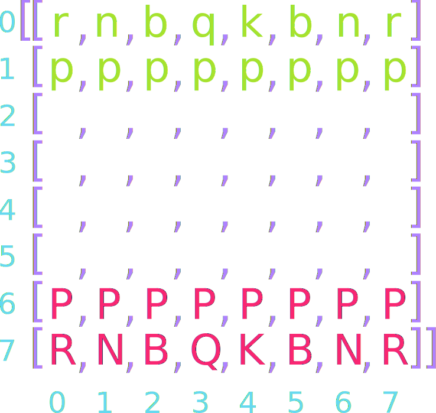
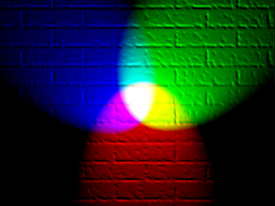

## Announcements
- Problem Set 5 released!
	- Not due until _next_ Friday
- Grade reports out?
- Last day to withdraw is one week from today
- I'll be away on Friday, but one of the section leaders is going to run class
	- Polling will still be happening!
- Polling: [rembold-class.ddns.net](http://rembold-class.ddns.net)


## Review! {data-notes="Solution: '2222'"}
What is the second element (index 1) in the below list?

`[i * 4 for i in "Oct 21, 2022" if not i.isalpha()]`{style="display: block; margin: auto; text-align: center;"}

<br>

:::{.poll}
#. `21`
#. `",,,,"`
#. `"cccc"`
#. `"2222"`
:::
<!--
## Multidimensional Arrays
- We know that elements of a list can be lists in and of themselves. If the lengths of all the lists making up the elements of a list remain fixed, then the list of lists is called a _multidimensional array_
- In Python, we can create multidimensional arrays just by creating lists of constant length as the elements to another list
  ```python
  magic = [ [2, 9, 4], [7, 5, 3], [6, 1, 8] ]
  ```
- We can always get the individual element of one of the inner lists by using **2** indices.
	- `magic[1][1] = 5`
	- `magic[-1][0] = 6`
-->

## Picturing Multidimensional Arrays
- Multidimensional arrays are commonly pictured as each inner list being stacked beneath the previous
- In such a representation, the outermost/first elements/indices represent the row, and the inner/second elements/indices represent the column

`[ [2, 9, 4], [7, 5, 3], [6, 1, 8] ]`{style="display: block; margin: auto; text-align: center;"}

<br>

\begin{tikzpicture}%%width=80%
[
block/.style = {draw, MGreen, outer sep=0pt, font=\Large, minimum size=1cm},
]
\node[block](00) at (0,0) {2};
\node[block,below=0 of 00](10) {7};
\node[block,below=0 of 10](20) {6};

\node[block,right=0 of 00](01) {9};
\node[block,right=0 of 10](11) {5};
\node[block,right=0 of 20](21) {1};

\node[block,right=0 of 01](02) {4};
\node[block,right=0 of 11](12) {3};
\node[block,right=0 of 21](22) {8};


\node[block,color=MBlue,font=\tt,](00) at (5,0) {magic[0][0]};
\node[block,color=MBlue,font=\tt,below=0 of 00](10) {magic[1][0]};
\node[block,color=MBlue,font=\tt,below=0 of 10](20) {magic[2][0]};

\node[block,color=MBlue,font=\tt,right=0 of 00](01) {magic[0][1]};
\node[block,color=MBlue,font=\tt,right=0 of 10](11) {magic[1][1]};
\node[block,color=MBlue,font=\tt,right=0 of 20](21) {magic[2][1]};

\node[block,color=MBlue,font=\tt,right=0 of 01](02) {magic[0][2]};
\node[block,color=MBlue,font=\tt,right=0 of 11](12) {magic[1][2]};
\node[block,color=MBlue,font=\tt,right=0 of 21](22) {magic[2][2]};
\end{tikzpicture}


## Initialize a Chessboard {data-transition="slide-in fade-out" data-transition-speed="slow"}
{data-id="test" data-auto-animate-easing=ease-out}

## Initialize a Chessboard{data-transition="fade-in fade-out" data-transition-speed="slow"}
{data-id="test"}

## Initialize a Chessboard{data-transition="fade-in slide-out" data-transition-speed="slow"}
{data-id="test"}


## The `GImage` Class
- You can display an image from a file in PGL using the `GImage` class.
`GImage(filename, x, y)`{.inlinecode}
	- `filename` is the string containing the name of the file which contains the image
	- `x` and `y` are the coordinates of the upper left corner of the image
- Best to use one of the common image formats
	- Graphical Interchange Format (GIF): `fish.gif`
	- Joint Photographic Experts Group (JPEG): `fish.jpg`
	- Portable Network Graphics (PNG): `fish.png`


## Images and Copyrights
- Most images that you might find on the web are protected by copyright under international law.
- Ensure you have the necessary permissions before using an image
	- On the web, the image hosting site will often specify what rules apply to that image
		- Example: Images from `www.nasa.gov` can be freely used as long as you add an attribution line
	- Non-commercial use of an image can sometimes fall under "fair use" doctrine, but academic integrity and common courtesy both demand you cite or acknowledge any material you have obtained from others.


## Example: VLA Moonset
```{.python style='max-height: 800px; font-size:.7em;'}
from pgl import GImage, GWindow, GLabel

def image_example():
	gw = GWindow(800, 550)
	image = GImage("VLA_Moonset.jpg")
	image.scale(gw.get_width() / image.get_width())
	gw.add(image)

	citation = GLabel("Image Credit: Jeff Hellermann, NRAO / AUI / NSF")
	citation.set_font("15px 'Sans-Serif'")
	x = gw.get_width() - citation.get_width() - 10
	y = image.get_height() + citation.get_ascent()
	gw.add(citation, x, y)
```


## 2D Arrays → Images
- Image data is commonly stored in two-dimensional arrays
- Each element stores information about the pixel that exists at that location
- The `GImage` class lets you convert between the image itself and the array representing the image contents by using the `get_pixel_array` method, which returns a two-dimensional array of integers.
- We could get the pixels from our example image using:
  ```python
  image = GImage("VLA_Moonset.jpg")
  pixels = image.get_pixel_array()
  ```
- The first index of the pixel array gets you the row, the second index gets you the column


## Pixel Contents
- Each element in a pixel array is an integer in which the 32 bits are interpreted as:

\begin{tikzpicture}%%width=90%
[
box/.style={draw, very thick, outer sep=0pt}
]

\node[box, MPurple, text=white, font=\tt, label={[MPurple,font=\large\em]below:transparency}] (alpha) at (0,0) {1 1 1 1 1 1 1 1};
\node[box, MRed,  text=white, font=\tt, label={[MRed,font=\large\em]below: red}, right = 1mm of alpha] (red) {1 0 0 1 0 1 0 1};
\node[box, MGreen, text=white, font=\tt, label={[MGreen,font=\large\em]below: green}, right = 1mm of red] (green) {0 0 1 1 1 0 0 1};
\node[box, MBlue, text=white, font=\tt, label={[MBlue,font=\large\em]below: blue}, right = 1mm of green] (blue) {0 1 1 0 0 0 1 1};
\end{tikzpicture}

- The first byte (8 bits) is the transparency or alpha
- The next three bytes indicate the amount of red, green, and blue in the pixel, where each value varies from 0 to 255
	- Form the RGB of a color, generally expressed in hexadecimal form
		- `10010101` → `0x95`
		- `00111001` → `0x39`
		- `01100011` → `0x63`
	- Overall color: `#953963`{.no-highlight} or <svg width="100" height="50" style="display:inline-block; vertical-align:middle"><rect width="100" height="50" style="fill:#953963"></rect></svg>


## Combining Light Colors

{width=60%}


## Transparency
- The first byte (8 bits) of the pixel value gives the transparency, which indicates how much of the background is allowed to show through
- Often denoted with the Greek letter alpha: $\alpha$
- Varies from 0 to 255 like the other 8 bit values:
	- 0 is entirely transparent
	- 255 is entirely opaque


## Breaking out the Colors
- You do not need to convert the pixel values yourself! PGL has built-in ways to extract the various colors

:::{style="font-size:.8em;"}

Function | Description
--- | -----
`GImage.get_red(pixel)` | Returns the integer (0-255) corresponding to the red portion of the pixel
`GImage.get_green(pixel)` | Returns the integer (0-255) corresponding to the green portion of the pixel
`GImage.get_blue(pixel)` | Returns the integer (0-255) corresponding to the blue portion of the pixel
`GImage.get_alpha(pixel)` | Returns the integer (0-255) corresponding to the alpha portion of the pixel
`GImage.create_rgb_pixel(r,g,b)` | Returns a 32-bit integer corresponding to the desired color

:::
