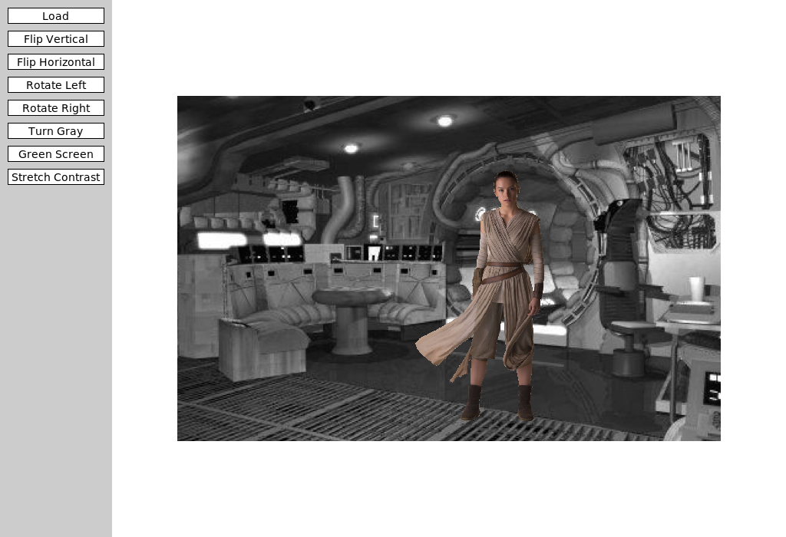
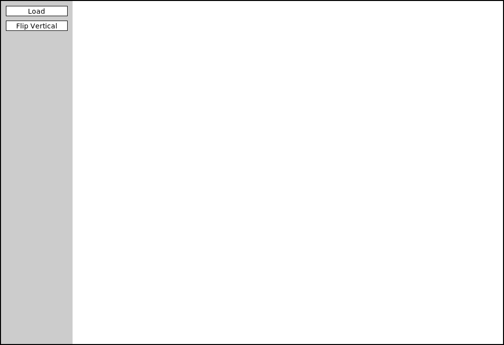

## Announcements
- Problem Sets 5 is due _tomorrow_ at 12 noon
- Grading of project 1 to be published soon.
- Project 3 will be posted latest _tomorrow_. You will be notified when uploaded
- CS151 Graphics Contest is due on ***EOD tomorrow***. No extension will be granted!
- Feel that things are not going as expected and need to withdraw? See me to discuss
	- The deadline is this week 
- Polling: [https://www.polleverywhere.com/agbofred203](https://www.polleverywhere.com/agbofred203)


<!--
## What if it didn't go well?
- Some things to keep in mind, especially if you didn't do as well as you'd hoped:
	- The midterm is only 20% of your course grade. Projects are worth 30%.
		- If you got a 50% on this midterm, it has just made getting an A quite difficult (though this class does have extra credit opportunities!). It is still **very** possible to pass the course.
	- You'll have 3 hours for the final, so time should be less an issue
	- Identify what went wrong!
		- Did you not know where to start?
		- Were you uncomfortable with common functions or syntax?
		- Did you not read instructions well?
		- Did your method(s) of studying prove ineffective?
	- We can only improve if we can identify what went wrong here first!

## Review! {data-notes="Solution: "}
Suppose I construct the below 2D array using list comprehension:

`A = [[i+j for i in range(3)] for j in range(4)]`{.inlinecode .python}

What would be the output of:

`print([A[i][2] for i in range(len(A))])`{.inlinecode .python}

<br>

:::{.poll}
#. `[0,1,2]`
#. `[2,3,4]`
#. `[2,3,4,5]`
#. `[2,2,2,2]`
:::

-->

## Review! {data-notes="Solution: D, others print the ."}
::::::cols
::::col
To the right are the contents of a text file named `PBride.txt`. Which code snippet below would print off the word "father"?
::::

::::col
```{.no-highlight style="color:white;"}
My name is Inigo Montoya.
You killed my father.
Prepare to die.
```

::::
::::::

::::::cols
::::col

:::{.block name=A}
```python
with open('PBride.txt') as f:
	for line in f:
		w = line.split()
		if w[0] == "You":
			print(w[-1])
```
:::

:::{.block name=B}
```python
c = read('PBride.txt')
print(c.find("father"))
```
:::


::::

::::col

:::{.block name=C}
```python
with open('PBride.txt') as f:
	c = f.read().splitlines()
	print(c[1][4])
```
:::

:::{.block name=D}
```python
with open('PBride.txt') as f:
	c = f.read()
	i = c.find("f")
	print(c[i:i+6])
```
:::

::::
::::::

## Writing Text Files
- You can write text files using almost the same syntax as reading:
  ```python
  with open(filename, mode) as file_handle:
  	  # Code to write the file using file_handle
  ```
- Note the `mode` parameter to `open` here! Mode is a string which is either
	- `"w"` to **write** a new file (or overwrite an existing file)
	- `"a"` to **append** new contents to the end of an existing file
- The file handler supports the methods:
	- `.write(some_string)` to write a string to the file
	- `.writelines(iterable_of_strings)` to write each iterable element to the file


## Writing ASCII SINE
- Suppose I wanted to try my hand at some ASCII art and fill a text file with a vertical oscillating sine wave
- A sine wave generally looks like:
	$$ A + A \sin\left(\frac{2\pi}{T}x\right)$$
  where $A$ is the amplitude of the wave and $T$ the period of the wave, or how quickly it repeats
  - The extra $A +$ out front is to push the wave over to the right, since we can't really place negative characters
- How can we put this together?


## ASCII SINE Code
```{.python style='font-size:.6em; max-height:900px;'}

from math import sin, pi

def sine_file(filename, A, T, symbol, padding=" "):
    """ 
    Creates a new sine wave in the provided file with the provided amplitude (A),
    and period (T) with the indicated symbol at the end.

    Inputs:
        filename (string): the name of the file to write the art to
        A (int): the amplitude of the wave in terms of number of characters
        T (int): the period of the wave in terms of number of lines
        symbol (string): the symbol to place to mark the wave
        padding (string): what character to pad the left side of the wave with

    Outputs:
        None
    """

    def compute_symb_placement(A, T, x):
		"""Computes where the symbol should be placed."""
        value = A * sin(2 * pi / T * x) + A
        return int(value) # to integer character placement

    def construct_line(placement, symbol, padding):
		"""Constructs the line with the necessary padding and symbol at the end."""
        return padding * placement + symbol

    with open(filename, 'w') as fh:
        for x in range(10 * T): # write 10 periods worth of lines
            v = compute_symb_placement(A, T, x)
            line = construct_line(v, symbol, padding)
            fh.write(line + '\n') # need the newline character at the end!

if __name__ == '__main__':
    sine_file('sine_test.txt', A=30, T=50, symbol='X')
```


## Choosing Wisely

::: {style='font-size:.9em'}

- The Python package used to implement `pgl.py` also supports a mechanism to choose files interactively, made available through the `filechooser.py` library module.
- `filechooser.py` exports two functions:
	- `choose_input_file` for selecting a file
	- `choose_output_file` for selecting a folder and filename to save a file to
- Both open up a file dialog that lets you select/choose a file
	- Clicking Open or Save returns the full pathname of the file
	- Clicking Cancel returns an empty string

- Using it thus looks something like:
  ```python
  filename = choose_input_file()
  with open(filename) as f:
  	  # Code to read file
  ```
:::

## Introducing ImageShop
::::::cols
::::col
- While you have a PS due tomorrow, the next project will be due next week
- Taking a moment today to introduce Imageshop, and the guide will be posted by tomorrow
::::

::::col

::::
::::::

## Starting
::::::cols
::::col

::::

::::col
- ImageShop initially has only two buttons
	- "Load" will bring up a file selection box where you can chose what image to display
		- Internally, this is handled by a function that returns the chosen file path
	- "Flip Vertical" is the example feature button that flips an image vertically
::::
::::::

## Big Picture
- Each milestone in ImageShop boils down to:
	- Adding a button to the window to handle a new feature
	- Writing a simple callback function that sets the new image to be equal to the output of a new function you'll write
	- Writing that function, which will return a `GImage` type object
- You are always free to write whatever other helper functions you might like!
- ImageShop is the first project to start leveraging multi-file layouts:
	- Some functions will already be provided in `GrayscaleImage.py` that you can import into your main program
	- You are encouraged to write the necessary functions for Milestone 5 in their own file and import them in accordingly
	- To avoid scrolling madly around trying to find the code you want, this helps with that!


## GButtons
- To help facilitate working with buttons, ImageShop introduces a new type called `GButton`
- Each `GButton` gets a label and a callback function name that determines what function is called when that button is clicked
- ImageShop will come with a pre-defined `add_button` function which will take care of adding a new button to the correct part of the screen.
	- You'll just need to provide it a label and function name to callback to


## The Current Image
- ImageShop holds the `GImage` currently displayed on the window in a variable called `gw.current_image`
- The variable is specifically added as an attribute to `gw` so that you will have access to it in any callback function you write
- This will generally be the input to your manipulation functions, since most work with whatever image was currently displayed on the screen
- Your callback function will run `set_image` on the output of your manipulation function, which will take care of updating the value of `gw.current_image`

## Milestone 1
- Milestone 1 has you adding a "Flip Horizontal" button
	- Add the button
	- Add the action callback function
	- Write a function to manipulate the pixels to flip the image horizontally
- Slightly more complicated than the example function, but not much


## Milestone 2
::::::{.cols style='align-items: center'}
::::col
- Here you will add buttons to rotate the image left or right (or CW or CCW if you prefer)
- Most of the difficulty comes in keeping track of rows and columns
	- Need to create a new list of lists of the correct dimensions
	- Need to copy over the pixels from the original to the needed location in the new list
::::

::::col
\begin{tikzpicture}%%width=100%
	\foreach[evaluate={\c=int(60-12*\x)}] \x in {0,1,...,5} {
		\foreach \y in {0,1,2} {
			\node[minimum size=10mm, draw, fill=MGreen!\c, font=\tt\scriptsize](A\x\y) at (1.1*\x,-1.1*\y) {[\y][\x]};
		}
	}
	\foreach \x in {0,1,2} {
		\foreach[evaluate={\c=int(12*\y)}] \y in {0,1,...,5} {
			\node[minimum size=10mm, draw, fill=MGreen!\c, font=\tt\scriptsize](B\x\y) at (10+1.1*\x,-1.1*\y) {[\y][\x]};
		}
	}
	\foreach[evaluate={\y=int(5-\x)}] \x in {0,1,...,5} {
		\draw[ultra thick, -stealth, MBlue] ($(A\y0.center)-(0,.2)$) -- (B0\x);
	}
\end{tikzpicture}

::::
::::::

## Milestone 3
- Here you'll add a button to convert an image to grayscale
- If you understand the other library files that have been given to you as part of the project, this project should be the simplest!


## Milestone 4
- Here you get to enable a green screen effect!
- Unlike other buttons, when this one is clicked, you should use the file chooser library to prompt the user to select _another_ image
	- This is the image that will be overlaid on whatever image is currently shown on the screen
- You will want to start with an "empty" pixel array with the same dimensions as the background
- This will closely mimic our in-class example from Friday, where depending on how "green" a pixel is, you will choose between different choices
	- If green enough, you will copy the pixel from the _background_ image to your pixel array
	- If not green enough, you will copy the pixel from the _foreground_ image to your pixel array


## Milestone 5
- Here you'll implement one algorithm for increasing dynamic contrast across an image!
- Doing so requires several steps and different functions. It can be convenient to place these in their own file and import them into `ImageShop.py` as needed.
	- Compute all the pixel luminosities
	- Construct a histogram of these luminosity counts
		- Your histogram should have 256 elements, one for each possible luminosity
	- Construct a cumulative histogram using your histogram
	- Use the cumulative histogram to adjust the luminosity of each pixel in the pixel array
- You don't need to display the visual histograms! But they can be a great way to check that you are doing the other parts correctly.
	- Related to Problem 2 on this week's PS


## Extensions
- Give yourself time for extensions on this project!
- They are **easy**! Just come up with interesting or cool graphical effects and add a button for them!
- You'll look at several this week in your section meetings
	- Adding these in your project is encouraged and will be regarded as "sub-extensions", but come up with your own as well!
