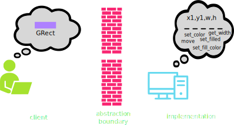
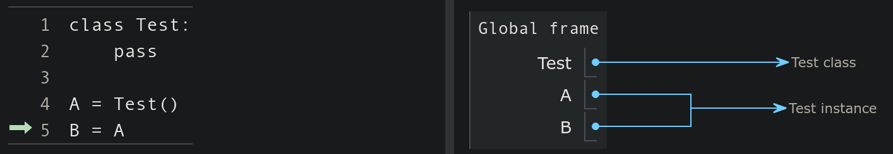

## Announcements
- Grading of problem sets 5 is not ready yet.
- Project 3 is due on _Tuesday next week_.
- Midterm 2 is **Friday November 10**
- Polling: [https://www.polleverywhere.com/agbofred203](https://www.polleverywhere.com/agbofred203)


## Review Question {data-notes="Solution: Error, can't add strings and tuples"}
::::::cols
::::col
What would be the output of the printed statement in the code to the right?

:::{.poll}
#. `(1, 'a', 'b')`{.no-highlight}
#. `(1, 'a')`{.no-highlight}
#. Error: can't add strings and tuples
#. Error: index out of range
:::

::::

::::col
```python
A = (1, 3, 5)
B = (2*A, ('a', ) )
C = B + ('b', 'c', 'd')
D = tuple()
for v in C[:3]:
	D += v[:1]
print(D)
```
::::
::::::


## Classes vs Objects
- When we introduced PGL early in the semester, we stressed the difference between types/classes and objects
	- A _class_ is the pattern or template that defines the structure and behavior of values with that particular type (the species of ant)
	- An _object_ is an individual value that belongs to a class (an individual ant)
		- A single class can be used to create any number of objects, each of which is said to be an _instance_ of that class
- PGL defines the `GRect` class.
	- In Breakout, you used that class to create **many** different rectangles, each of which was an instance of the `GRect` class


## Thinking about Objects


## An Object's Purpose
- Python uses the concepts of objects and classes to achieve at least three different goals:
	- __Aggregation__. Objects make it possible to represent collections of independent data as a single unit. Such collections are traditionally called _records_.
	- __Encapsulation__. Classes make it possible to store data together with the operations that manipulate that data.
		- In Python the data values are called _attributes_ and the operations are called _methods_
	- __Inheritance__. Class hierarchies make it possible for a class that shares some attributes and methods with a previously defined class to _inherit_ those definitions without rewriting them all
- We'll introduce many of these concepts in this course, but for more exposure and practice you'll want to take CS 152 (Data Structures)

## Classes as Templates
- Since they share the same attributes, it is natural to regard the two employees at Scrooge and Marley as two instances of the same class
- Could view the class as a template or empty form:
\begin{tikzpicture}%%width=40%
[record/.style={draw, minimum width=4cm, font=\tt},
lab/.style={font=\tt\small, anchor=south west},
]
\node[record, MBlue](n) at (0,0) {};
\node[lab, MBlue](nl) at (n.north west) {name};
\node[record, MBlue, below=.75cm of n](t){};
\node[lab, MBlue] at (t.north west) {title};
\node[record, MBlue, below=.75cm of t](s) {};
\node[lab, MBlue] at (s.north west) {salary};
\node[fit=(nl)(s), draw, very thick, MBlue] {};
\end{tikzpicture}

- Can help initially to just start with an empty template and then fill in the necessary fields

## Starting Empty
- Class definitions in Python start with a header line consisting of the keyword `class` and then the class name
- The body of the class will later contain definitions, but initially can just leave blank
	- Almost. Python does not allow an empty body, so need to include a docstring or use the `pass` keyword
  ```python
  class Employee:
  	"""This class is currently empty!"""
  ```
- Once the class is defined, you can create an object of this class type by calling the class as if it were a function:
  ```python
  clerk = Employee()
  ```

## More References
- Instances of custom Python classes are mutable
- Thus custom class instances are stored as _references_ to that information in memory
- Any code with access to this reference can manipulate the object
	- Can get or set the contents of any attributes or create new ones
<br><br>




## Selecting Object Attributes
- You can select an attribute from an object by writing out the object name, followed by a dot and then the attribute name.
	- As an example

		```python
		clerk.name
		```
		would select the `name` attribute for the `clerk` object
- Attributes are assignable, so

	```python
	clerk.salary *= 2
	```
	would double the clerk's current salary

- You can create a new attribute in Python by simply assigning a name and a value, just like you'd define a new variable

## Assigning Clerk Attributes
- We could, for instance, create a `clerk` in the following fashion:
  ```python
  def create_clerk():
  	clerk = Employee()
  	clerk.name = "Bob Cratchit"
  	clerk.title = "clerk"
  	clerk.salary = 15
	return clerk
  ```
- Note that none of these assigned attributes affect the `Employee` class in any way


## More Generally
- We could accomplish this more generally by passing arguments to our function:
  ```python
  def create_employee(name, title, salary):
	emp = Employee()
	emp.name = name
	emp.title = title
	emp.salary = salary
	return emp
  ```
- We could then use that as:
  ```python
  clerk = create_employee('Bob Cratchit', 'clerk', 15)
  boss = create_employee(
			'Ebeneezer Scrooge', 'founder', 1000
			)
  ```


## Constructors
- While the previous method works, it is not ideal
	- Forces the client to tinker with the internal workings of the Employee
	- Details of the data structure are the property of the implementation, not the client
- Better to add a method to the `Employee` class called a _constructor_, which is responsible for initializing attributes to a newly created object
	- In Python, a constructor is created by defining a special function named `__init__`
	- The constructor function is called automatically whenever a new object of that type is created


## Know Thy `self`
:::incremental
- Moving the function into the Employee class has a problem:
	- When we set attributes, they are specific to a given object
	- The class itself though is just a template, and not linked to a specific object
- We need a general way within the class to refer to whatever object is being created
	- The overwhelming convention in Python is to call this variable `self`
	- Whenever a new object is created, you could imagine that, for that object, Python replaces all of the `self`s in the class with that object's name
		- This isn't quite the order of what is happening, but it can help envision what `self` is doing
- `self` is always the first parameter to the `__init__` constructor
	- Any other arguments provided are passed in as additional parameters afterwards
:::

## An Employee Constructor
```python
class Employee:
	def __init__(self, name, title, salary):
		self.name = name
		self.title = title
		self.salary = salary


clerk = Employee('Bob Cratchit', 'clerk', 15)
```
- Note that you do not need to provide an argument for `self` when creating the object, Python supplies this reference automatically
- Viewing in PythonTutor can be helpful, as is shown [here](https://pythontutor.com/render.html#code=class%20Employee%3A%0A%20%20%20%20def%20__init__%28self,%20name,%20title,%20salary%29%3A%0A%20%20%20%20%20%20%20%20self.name%20%3D%20name%0A%20%20%20%20%20%20%20%20self.title%20%3D%20title%0A%20%20%20%20%20%20%20%20self.salary%20%3D%20salary%0A%0A%0Aclerk%20%3D%20Employee%28'Bob%20Cratchit',%20'clerk',%2015%29&cumulative=false&curInstr=0&heapPrimitives=nevernest&mode=display&origin=opt-frontend.js&py=3&rawInputLstJSON=%5B%5D&textReferences=false)


## Understanding Check
::::::cols
::::col
What is printed out on the final line of code to the right?

:::{.poll}
#. `Honda red 2006`{.no-highlight}
#. `Honda blue 2006`{.no-highlight}
#. `Toyota blue 2008`{.no-highlight}
#. `Honda red 2008`{.no-highlight}
:::

::::

::::{.col style='flex-grow:2'}
```{.python style='max-height:800px'}
class Car:
	def __init__(self, color, year):
		self.color = color
		self.year = year
		self.make = 'Toyota'

A = Car('blue', 2008)
B = Car('red', 2006)
A.make = 'Honda'
A.year = B.year
print(A.make, A.color, A.year)
```
::::
::::::


## What's your Method?
- Most classes define additional functions called methods to allow clients to read or update attributes or manipulate the object
- Methods look like a normal function definition but will **always** declare the parameter `self` at the beginning of the parameter list
	- This is true even if the method has no other parameters
- Methods are defined in the body of the class and would thus look something like:
  ```python
  def method_name (self, other_parameters):
  	...body of the method...
  ```
- For example
  ```python
  def give_raise(self, amount):
  	self.salary += amount
  ```

## Accessing and Using Methods
- After definition, there are two mains ways you can access and use the method:
	- **Dot Notation (Conventional)**
		- Python sets `self` to be a reference to the _receiver_, which is the object to which the method is applied

		  ```python
		  clerk = Employee('Bob', 'clerk', 15)
		  clerk.give_raise(15)
		  ```

	- **Function Notation**
		- You retrieve the method from the class itself, and then provide self manually

		  ```python
		  clerk = Employee('Bob', 'clerk', 15)
		  Employee.give_raise(clerk, 15)
		  ```

## Visualization Summary
- To summarize in a visual manner, we can look at everything together on [PythonTutor](http://pythontutor.com/live.html#code=class%20Employee%3A%0A%20%20%20%20def%20__init__%28self,%20name,%20title,%20salary%29%3A%0A%20%20%20%20%20%20%20%20self.name%20%3D%20name%0A%20%20%20%20%20%20%20%20self.title%20%3D%20title%0A%20%20%20%20%20%20%20%20self.salary%20%3D%20salary%0A%20%20%20%20%20%20%20%20%0A%20%20%20%20def%20give_raise%28self,%20amount%29%3A%0A%20%20%20%20%20%20%20%20current%20%3D%20self.salary%0A%20%20%20%20%20%20%20%20self.salary%20%2B%3D%20amount%0A%20%20%20%20%20%20%20%20%0A%0Aclerk%20%3D%20Employee%28%22Bob%20Cratchit%22,%20%22clerk%22,%2015%29%0Aboss%20%3D%20Employee%28%22Scrooge%22,%20%22founder%22,%201000%29%0A%0Aclerk.give_raise%2820%29&cumulative=false&curInstr=1&heapPrimitives=nevernest&mode=display&origin=opt-live.js&py=3&rawInputLstJSON=%5B%5D&textReferences=false)

{width=50%}

## Getters and Setters
- In the object-oriented model, the client is not supposed to muck-about with the object internals
- The implementation should therefore provide methods to retrieve desired attributes (called _getters_) or to make changes to desired attributes (called _setters_)
- Setting up getters and setters for the attribute `salary` might look like:
  ```python
  def get_salary(self):
  	return self.salary
  
  def set_salary(self, new_salary):
  	self.salary = new_salary
  ```
- Getters are far more common than setters, as you don't always want the client to have the freedom to change attributes on a whim


## Representation
- Printing out an object that you just created as an instance of a custom class will look ugly:
  ```python-repl
  >>> C = Employee('Bob', 'clerk', 15)
  >>> print(C)
  <__main__.Employee object at 0x7f942ba13550>
  ```
- You can define special methods for a class that specify how your object should be converted to a string (or anything else really)
	- All these special methods have double underscores before and after, and hence are frequently termed "dunder" (double underscore) methods
	- You can the `__str__` or `__repr__` method to specify how your object should be printed

## A Good Employee
```{.python style='max-height:900px'}
class Employee:
	def __init__(self, name, title, salary):
		self.name = name
		self.title = title
		self.salary = salary

	def __str__(self):
		return f"{self.name} ({self.title}): {self.salary}"

	def get_salary(self):
		return self.salary

	def set_salary(self, new_salary):
		self.salary = new_salary
```
