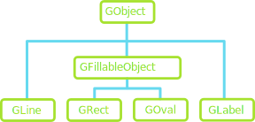

## Announcements
- Grading of problem sets 5 is not ready yet! Apologies!.
- Project 3 is due _tomorrow_ at 12:00 PM.
- Midterm 2 is **this week Friday at 9:10-10:10 am**
    - I’m going to post practice exams and learning objectives for you today
    - Focused on Chapters 4-6, and 8 (graphics, functions, and lists)
    - No problem set this week: just studying for exam
- Wednesday class will welcome a guest faculty - Prof. Calvin 
    - Talk on CS/DS Fall Advising Preview!
    - Calvin will be briefly discussing what classes are being offered
    - then how to help folks out with advising, major declarations, etc.
- Polling: [https://www.polleverywhere.com/agbofred203](https://www.polleverywhere.com/agbofred203)

## Review Question {data-notes="Solution: Loly, black, 4 becuase color in constructor was not referenced but defualted"}
::::::cols
::::col
What would be the output of the printed statement in the code to the right?

:::{.poll}
#. Loly black 2
#. Loly brown 4
#. Loly, black, 4
#. Loly, brown, 4
:::

::::

::::col
```{.python style='min-height:940px; width: 1200px'}
class Pet:
    def __init__(self, name, color, age):
        self.name = name
        self.color="black"
        self.age = age

    def bmi(self, weight, height):
        if weight/height > 2:
            self.age = self.age*2
        else:
            self.age += 1
dog = Pet("Loly", "brown", 2)
dog.bmi(180,45)
print(f'{dog.name}, {dog.color}, {dog.age}')

```
::::
::::::

## What's your Method?
- Most classes define additional functions called methods to allow clients to read or update attributes or manipulate the object
- Methods look like a normal function definition but will **always** declare the parameter `self` at the beginning of the parameter list
	- This is true even if the method has no other parameters
- Methods are defined in the body of the class and would thus look something like:
  ```python
  def method_name (self, other_parameters):
  	...body of the method...
  ```
- For example
  ```python
  def give_raise(self, amount):
  	self.salary += amount
  ```

## Accessing and Using Methods
- After definition, there are two mains ways you can access and use the method:
	- **Dot Notation (Conventional)**
		- Python sets `self` to be a reference to the _receiver_, which is the object to which the method is applied

		  ```python
		  clerk = Employee('Bob', 'clerk', 15)
		  clerk.give_raise(15)
		  ```

	- **Function Notation**
		- You retrieve the method from the class itself, and then provide self manually

		  ```python
		  clerk = Employee('Bob', 'clerk', 15)
		  Employee.give_raise(clerk, 15)
		  ```

## Visualization Summary
- To summarize in a visual manner, we can look at everything together on [PythonTutor](http://pythontutor.com/live.html#code=class%20Employee%3A%0A%20%20%20%20def%20__init__%28self,%20name,%20title,%20salary%29%3A%0A%20%20%20%20%20%20%20%20self.name%20%3D%20name%0A%20%20%20%20%20%20%20%20self.title%20%3D%20title%0A%20%20%20%20%20%20%20%20self.salary%20%3D%20salary%0A%20%20%20%20%20%20%20%20%0A%20%20%20%20def%20give_raise%28self,%20amount%29%3A%0A%20%20%20%20%20%20%20%20current%20%3D%20self.salary%0A%20%20%20%20%20%20%20%20self.salary%20%2B%3D%20amount%0A%20%20%20%20%20%20%20%20%0A%0Aclerk%20%3D%20Employee%28%22Bob%20Cratchit%22,%20%22clerk%22,%2015%29%0Aboss%20%3D%20Employee%28%22Scrooge%22,%20%22founder%22,%201000%29%0A%0Aclerk.give_raise%2820%29&cumulative=false&curInstr=1&heapPrimitives=nevernest&mode=display&origin=opt-live.js&py=3&rawInputLstJSON=%5B%5D&textReferences=false)

{width=50%}

## Getters and Setters
- In the object-oriented model, the client is not supposed to muck-about with the object internals
- The implementation should therefore provide methods to retrieve desired attributes (called _getters_) or to make changes to desired attributes (called _setters_)
- Setting up getters and setters for the attribute `salary` might look like:
  ```python
  def get_salary(self):
  	return self.salary
  
  def set_salary(self, new_salary):
  	self.salary = new_salary
  ```
- Getters are far more common than setters, as you don't always want the client to have the freedom to change attributes on a whim

## Internal Representation
- The idea behind object oriented programming is that we interact with the class though methods, and the class takes care of the internal representation
- Python works well with this, but it doesn't really enforce it
	- We can freely access, change, or even add new attributes to the class
	- But **we really should not**
		- Maybe the class will get updated in a way that changes all the internal variable names. Now all our code refering to them is broken!
	- Use (and define) getters and setters for your classes!
- Convention is that we preface a class attribute with an underscore if we really want to make clear that the client should **not** mess with that attribute
	- This is just convention. Python will still allow it to be altered, but it is a really bad practice to get in the habit of doing

## Understanding Check
::::::cols
::::col
The code block to the right starts defining a class. Only 1 of the below options for defining an `increment` method will work. Which one?
::::

::::col
```python
class BestCounter:
  def __init__(self, start):
    self.counter = start
```
::::
::::::

::::::cols
::::col

:::{.block name=A}
```python
def increment(self, value):
	counter += value
```
:::

:::{.block name=C}
```python
def increment(value):
	counter += self.value
```
:::


::::

::::col

:::{.block name=B}
```python
def increment(self, value):
	self.counter += self.value
```
:::

:::{.block name=D}
```python
def increment(self, value):
	self.counter += value
```
:::

::::
::::::

## Representation
- Printing out an object that you just created as an instance of a custom class will look ugly:
  ```python-repl
  >>> C = Employee('Bob', 'clerk', 15)
  >>> print(C)
  <__main__.Employee object at 0x7f942ba13550>
  ```
- You can define special methods for a class that specify how your object should be converted to a string (or anything else really)
	- All these special methods have double underscores before and after, and hence are frequently termed "dunder" (double underscore) methods
	- Define the `__str__` or `__repr__` method to specify how your object should be printed

## A Good Employee
```{.python style='max-height:900px'}
class Employee:
	def __init__(self, name, title, salary):
		self.name = name
		self.title = title
		self.salary = salary

	def __str__(self):
		return f"{self.name} ({self.title}): {self.salary}"

	def get_salary(self):
		return self.salary

	def set_salary(self, new_salary):
		self.salary = new_salary
```
<!--
## Return of the Firework
```{.python style="max-height:900px; font-size:0.8em;"}
from pgl import GWindow, GOval, GRect
import random

GW_WIDTH = 500
GW_HEIGHT = 500

def random_color():
    color = "#"
    for _ in range(6):
        color += random.choice("0123456789ABCDEF")
    return color

class Firework:
    """ Creates a new firework with initial flight and then 
	explosion. 
	"""
    def __init__(self, size):
        self.obj = GOval(GW_WIDTH/2, GW_HEIGHT, size, size)
        self.obj.set_filled(True)
        self.obj.set_color("white")
        self.speed = 5
        self.heading = random.randint(60,120)
        self.fuse = random.randint(50,100)
        self.maxsize = random.randint(60,100)
        self.color = random_color()
        self.mode = 0

    def get_object(self):
        """ Returns the firework graphical object. """
        return self.obj

    def should_terminate(self):
        """ Checks if the firework should be removed. """
        return self.mode > 1

    def move(self):
        """ Moves the firework in its initial flight. """
        self.obj.move_polar(self.speed, self.heading)
        self.fuse -= 1
        if self.fuse < 0:
            self.mode += 1
            self.obj.set_color(self.color)

    def explode(self):
        """ Grows the firework explosion upon detonation. """
        R = 2
        x = self.obj.get_x()
        y = self.obj.get_y()
        S = self.obj.get_width()
        self.obj.set_bounds(x-R/2, y-R/2, S+R, S+R)
        if self.obj.get_width() >= self.maxsize:
            self.mode += 1

    def update(self):
        """ Controls what the firework should be doing during 
		each stage. 
		"""
        if self.mode == 0:
            self.move()
        elif self.mode == 1:
            self.explode()
       

def fireworks_show():
    """ Makes a fireworks show! """
    def step():
        """ Calls up update method on all fireworks in the box 
		and removes if necessary.
        """
        for f in firework_box[:]:
            f.update()
            if f.should_terminate():
                gw.remove(f.get_object())
                firework_box.remove(f)


    def give_me_more_fireworks():
        """ Adds more fireworks to the box. """
        new = Firework(2)
        firework_box.append(new)
        gw.add(new.get_object())

    gw = GWindow(GW_WIDTH, GW_HEIGHT)
    sky = GRect(GW_WIDTH, GW_HEIGHT)
    sky.set_filled(True)
    gw.add(sky)
    firework_box = []

    gw.set_interval(step, 20)
    gw.set_interval(give_me_more_fireworks, 100)

if __name__ == '__main__':
    fireworks_show()
```
-->
## Maps and Dictionaries
- A common form of information associates pairs of data values
	- Commonly called a _map_ in computer science
	- Python calls such a structure a _dictionary_
- A dictionary associates two different values:
	- A simple value called the _key_, which is often a string but doesn't need to be
	- A larger and more complex object called the _value_
- This idea of associating pairs of values is exhibited all over in the real world
	- Actual dictionaries! The words are the keys, the definitions the values.
	- Web addresses! Keys are the urls, the values are the webpage contents.

## Creating Dictionaries
- Python dictionaries use squiggly brackets `{}` to enclose their contents
- Can create an empty dictionary by providing no key-value pairs:
  ```python
  empty_dict = {}
  ```
- If creating a dictionary with key-value pairs
	- Keys are separated from values with a colon `:`
	- Pairs are separated by a comma `,`
  ```python
  generic_dict = {'Bob': 21, 0: False, 13: 'Thirteen'}
  ```

## Keys and Values
- The value of a key-value pair can be **any** Python object, mutable or immutable
	- This include other dictionaries!
- The key is more restricted:
	- Must be immutable
		- So dictionaries or lists can **not** work as a key
		- Tuples can though!
	- Must be unique per dictionary

::::::cols
::::col
:::{.block name=Viable}
```python
A = {True: 'Seth', False: 'Jesse'}
B = {'Jill': 13, 'Jack': 12}
C = {(1,2): {'x':1}}
```
:::
::::

::::col
:::{.block name=Illegal style='border-color:var(--red)'}
```python
X = {{'x': 1, 'y': 2}: 'Shark'}
Y = {[1,3,5]: 'Odd'}
Z = {'A': 13, 'B': 24, 'A': 15}
```
:::
::::
::::::


## Selection
- The fundamental operation on dictionaries is selection, which is still indicated with square brackets: `[]`
- Dictionaries though are **unordered**, so it is not a numeric index that goes inside the `[ ]`
- You instead use the key directly to select corresponding values:
  ```python-repl
  >>> A = {'Jack': 12, 'Jill': 13}['Jack']
  >>> print(A)
  12
  >>> B = {True: 13, 0: 'Why?'}[0]
  >>> print(B)
  Why?
  ```

## Losing your keys
- If you attempt to index out a key that doesn't exist:
  ```{.python .badcode}
  A = {'Jack': 12, 'Jill': 13}
  print(A['Jil'])
  ```
  you will get an error!
- If in doubt, check for the presence of a key with the `in` operator:
  ```python
  if 'Jil' in A:
	  print(A['Jil'])
  ```

## Rewriting the Dictionary
- Dictionaries are _mutable_!
	- We can add new key-value pairs
	- We can change the value of corresponding keys
```python-repl
>>> d = {}
>>> d['A'] = 10
>>> d['B'] = 12
>>> print(d)
{'A':10, 'B':12}
>>> d['A'] = d['B']
>>> print(d)
{'A':12, 'B':12}
```

<!--
## Class Hierarchies
- Much of the power of modern object-oriented languages comes from them supporting the idea of _class hierarchies_
	- Any class can be designated as a _subclass_ of another class, which is then called its _superclass_
- Each subclass represents some sort of **specialization** of its superclass
	- Creating an object of a subclass also means that object is an instance of all the other classes above it in the superclass chain
- When defining a new class in Python, it _inherits_ the behavior of its superclass
- Python does support _multiple inheritance_, but most class hierarchies operation on _single inheritance_, where a subclass has only one unique superclass


## Recalling the `GObject` Hierarchy




## Specifying Inheritance
- Subclass definitions in Python differ from standalone classes in two ways:
	#. A subclass definition includes the name of its superclass in parentheses after the name of the subclass
	#. The constructor for the subclass explicitly calls the constructor for its superclass before doing its own initialization
- Together, they form the following pattern:
```python
class subclass(superclass):
	def __init__(self, parameters):
		superclass.__init__(self, any_relevant_parameters)
		# Rest of subclass initialization
```

## A Swashbuckling Example
\begin{tikzpicture}%%width=70%
[
every node/.style={minimum size = 2cm, rounded corners, draw, ultra thick, font=\bf, align=left},
]
	\node[Orange](human) at (0,0) {Human};
	\node[Red, right=1cm of human](pirate) {Pirate};
	\node[Blue, above right=0mm and 1cm of pirate](pegleg) {PegLeg};
	\node[Blue, below right=0mm and 1cm of pirate](patch) {Patch};

	\path[very thick, -stealth, white]
		(pegleg) edge (pirate)
		(patch) edge (pirate)
		(pirate) edge (human);
\end{tikzpicture}

## Some Swashbuckling Code
```{.python style='max-height:900px'}
class Human:
	def __init__(self, name, age):
		self.name = name
		self.age = age
		self.legs = 2

	def __str__(self):
		return f'Human({self.name},{self.age})'

	def agree(self):
		print('Sure!')

class Pirate(Human):
	def agree(self):
		print("Aye matey!")

	def __str__(self):
		return f'Pirate({self.name},{self.age})'

class Pegleg(Pirate):
	def __init__(self, name, age):
		Pirate.__init__(self, name, age)
		self.legs = 1
	
	def __repr__(self):
		return f'Pegleg({self.name},{self.age})'

class Patch(Pirate):
	def __init__(self, age):
		Pirate.__init__(self, name, age)
		self.eyes = 1

	def __repr__(self):
		return f'Patch({self.name}, {self.age})'


```

## Overusing Inheritance
- Inheritance is often used in situations where it does not really apply
	- A common example you might see in textbooks is a `Pizza` class with various subclasses of pizza, like Pepperoni or Hawaiian.
	- This is silly, there is only one point of difference between those: the ingredients
		- Just make a pizza class with a list of ingredients as an attribute
- Inheritance makes sense when subclasses share behavior


-->
