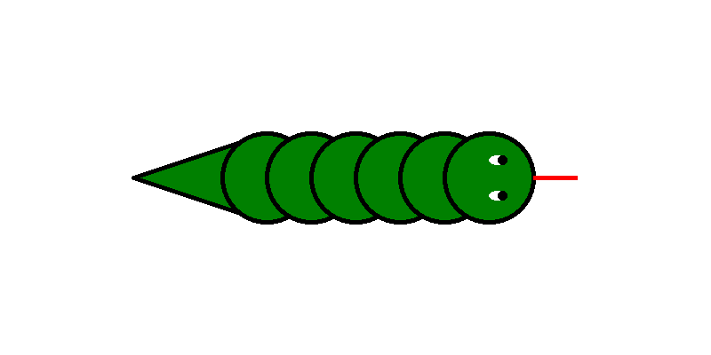

## Announcements
- ImageShop due tonight!
- I'll be around most of the afternoon until 6:30
- New (and last!) problem set will go out tomorrow
- My priority this weekend is to get grade reports issued
	- I'm deeply sorry these have taken as long as they have. I've needed time to make changes to my system and the past 3 weeks have been crazy for me
- Polling: [rembold-class.ddns.net](http://rembold-class.ddns.net)


## Review Question
::::::cols
::::col
The code block to the right starts defining a class. Only 1 of the below options for defining an `increment` method will work. Which one?
::::

::::col
```python
class BestCounter:
  def __init__(self, start):
    self.counter = start
```
::::
::::::

::::::cols
::::col

:::{.block name=A}
```python
def increment(self, value):
	counter += value
```
:::

:::{.block name=C}
```python
def increment(value):
	counter += self.value
```
:::


::::

::::col

:::{.block name=B}
```python
def increment(self, value):
	self.counter += self.value
```
:::

:::{.block name=D}
```python
def increment(self, value):
	self.counter += value
```
:::

::::
::::::


## Specifying Inheritance
- Subclass definitions in Python differ from standalone classes in two ways:
	#. A subclass definition includes the name of its superclass in parentheses after the name of the subclass
	#. The constructor for the subclass explicitly calls the constructor for its superclass before doing its own initialization
- Together, they form the following pattern:
  ```python
  class subclass(superclass):
  	def __init__(self, parameters):
  		superclass.__init__(self, any_relevant_parameters)
  		# Rest of subclass initialization
  ```

## A Swashbuckling Example
\begin{tikzpicture}%%width=70%
[
every node/.style={minimum size = 2cm, rounded corners, draw, ultra thick, font=\bf, align=left},
]
	\node[Orange](human) at (0,0) {Human};
	\node[Red, right=1cm of human](pirate) {Pirate};
	\node[Blue, above right=0mm and 1cm of pirate](pegleg) {PegLeg};
	\node[Blue, below right=0mm and 1cm of pirate](patch) {Patch};

	\path[very thick, -stealth, white]
		(pegleg) edge (pirate)
		(patch) edge (pirate)
		(pirate) edge (human);
\end{tikzpicture}

## Some Swashbuckling Code
```{.python style='max-height:900px'}
class Human:
	def __init__(self, name, age):
		self.name = name
		self.age = age
		self.speed = 10
		self.perception = 10

	def __repr__(self):
		return f'Human({self.name},{self.age})'

	def agree(self):
		print('Sure!')

class Pirate(Human):
	def agree(self):
		print("Aye matey!")

	def __repr__(self):
		return f'Pirate({self.name},{self.age})'

class Pegleg(Pirate):
	def __init__(self, name, age):
		Pirate.__init__(self, name, age)
		self.speed = 5
	
	def __repr__(self):
		return f'Pegleg({self.name},{self.age})'

class Patch(Pirate):
	def __init__(self, age):
		Pirate.__init__(self, name, age)
		self.perception = 5

	def __repr__(self):
		return f'Patch({self.name}, {self.age})'


```

## Overusing Inheritance
- Inheritance is often used in situations where it does not really apply
	- A common example you might see in textbooks is a `Pizza` class with various subclasses of pizza, like Pepperoni or Hawaiian.
	- This is silly, there is only one point of difference between those: the ingredients
		- Just make a pizza class with a list of ingredients as an attribute
- Inheritance makes sense when subclasses share behavior


## Extensions
- While designing new class hierarchies will prove useful as you move on to larger applications, it is often more useful to **extend** existing classes to add new, desirable behavior
- This can be done with any existing class, but a few classes in the `GObject` hierarchy make very enticing targets as the bases for potential extension:
	- The `GPolygon` class makes it easy to define new subclasses that have a polygonal outline.
		- Also automatically support filling, since `GPolygon` is a subclass of `GFillableObject`
	- The `GCompound` class can serve as a great parent for new subclasses that are composed of a combination of other shapes.
- In either case, it is generally useful to add additional methods or attributes to the subclass that are specific to that type.


## Graphical Object Decomposition
- Using the `GCompound` class as a parent class makes it possible to apply the strategy of decomposition to graphical objects!
	- Can decompose a graphical display into successively simpler pieces
- Here I will use as an example a simple segmented snake
<br><br>

{width=40%}


## The Snake Hierarchy
- Here I will utilize a generic snake body segment which will be a subclass of `GCompound`
	- The snake head and tail segments will then be subclasses of the body segment class
\begin{tikzpicture}%%width=60%
[
every node/.style = {draw, very thick, rounded corners, Teal, inner sep=10pt, font=\Large\tt},
]
\node (GC) at (0,0) {GCompound};
\node[right=2cm of GC] (Seg) {Segment};
\draw[very thick, Orange, -stealth] (Seg) -- (GC);
\node[above right=0.5cm and 2cm of Seg] (Head) {Head};
\node[below right=0.5cm and 2cm of Seg] (Tail) {Tail};
\path[very thick, Orange, -stealth] (Head) edge (Seg) (Tail) edge (Seg);
\end{tikzpicture}


- All the common elements will be added in the body segment, with the head and tail subclasses only adding their specific details.

## Nesting Snakes
- Since a `GCompound` is also a `GObject`, you can go ahead and add a `GCompound` to another `GCompound`
- Here I will add all the snake pieces to a new class `Snake`, which is a subclass of `GCompound`
- One advantage of doing so is that we can then animate the entire snake as a whole easily!


## Snakey Code
```{.python style='max-height:900px'}
from pgl import GWindow, GCompound, GOval, GLine, GPolygon

R = 50

class Segment(GCompound):
    """ Create as generic snake body segment. """
    def __init__(self):
        GCompound.__init__(self)
        body = GOval(-R, -R, 
					 2*R, 2*R)
        body.set_filled(True)
        body.set_fill_color('green')
        body.set_line_width(5)
        self.add(body)

class Tail(Segment):
    def __init__(self):
        Segment.__init__(self)
        tri = GPolygon()
        tri.add_vertex(0, R)
        tri.add_vertex(0, -R)
        tri.add_vertex(-3*R, 0)
        tri.set_filled(True)
        tri.set_fill_color('green')
        tri.set_line_width(5)
        self.add(tri)
        tri.send_to_back()

class Eye(GCompound):
    def __init__(self):
        GCompound.__init__(self)
        eye = GOval(-10,-5,20,10)
        eye.set_filled(True)
        eye.set_color("white")
        pupil = GOval(-5,-5,10,10)
        pupil.set_filled(True)
        self.add(eye,-10,-5)
        self.add(pupil, 0,-5)

class Head(Segment):
    def __init__(self):
        Segment.__init__(self)
        self.add(Eye(), 10, 20)
        self.add(Eye(), 10, -20)
        tongue = GLine(R, 0, 2*R, 0)
        tongue.set_line_width(5)
        tongue.set_color('red')
        self.add(tongue)

class Snake(GCompound):
    """ Put all the snake pieces together. """
    def __init__(self, length):
        GCompound.__init__(self)
        self.add(Tail(), 0, 0)
        for i in range(1,length-1):
            self.add(Segment(), i*R, 0)
        self.add(Head(), (length-1)*R, 0)

def make_snake():
    def move_snake():
        snake.move(10,0)

    gw = GWindow(800,400)
    snake = Snake(3)
    gw.add(snake, -500,200)
    gw.set_interval(move_snake, 30)

make_snake()
```
