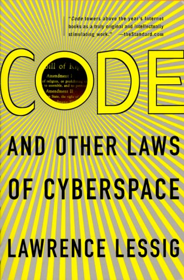
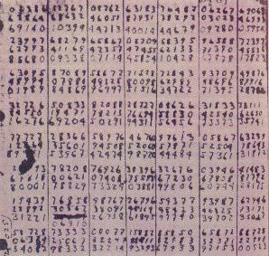
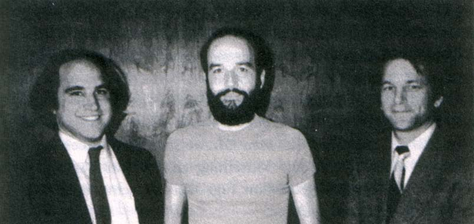

## Announcements
:::{style="font-size:0.9em"}
- Project 5 due tonight!
	- If you worked with a partner, make sure **both** are added to the Github group
	- If you are working with someone from the other class section, make sure you clearly have both your names at the top of at least the main script
- Do you still have late work to be turned in? The last day I'll be accepting anything will be Sunday night at midnight.
- Final Exam study materials posted!
- Interested in becoming a section leader next semester? Applications will be sent out today.
:::

## Public-Key Encryption
::::::cols
::::col
- In 1999, Harvard Law professor Larry Lessig publish _Code and Other Laws of Cyberspace_
- Argues that cryptography is the most revolutionary development of the last millennium.
::::

::::col

::::
::::::

> Here is something that will sound very extreme but is at most, I think, a slight exaggeration: encryption technologies are the most important breakthrough in the last thousand years. No other technological discovery... will have a more significant impart on our social and political life. Cryptography will change everything.

## Idealized Encryption

## Searching for the Perfect Code
- The problem does have a solution, in theory
- Have receiver and sender share a codebook with the following properties:
	- The codebook is so large that none of it is every reused
	- The mapping of plaintext letters is **random** in the sense that past mappings convey no information about later ones
- Since individual entries are never reused, the approach is generally called a _one-time pad_.
	- Also called a _Vernam cipher_ after Gilbert Vernam, an engineer at AT&T Bell Labs who patented the technique in 1917

## One-Time Pads
::::::cols
::::col
- One-time pads have been used in practice on several occasions:
	- The Soviet Union used a one-time pad for communications in World War II.
	- When Che Guevara was killed by the CIA in Bolivia in 1968, he was carrying a one-time pad he used to communicate with Fidel Castro
- In practice, the one-time pad is problematic because of the size of the codebook and the difficulty in distributing it securely.
::::

::::col
{width=100%}
::::
::::::

## Solving Key Distribution
- The problem of distributing encryption keys is difficult only if the keys must be kept secret.
- The ideas that keys can be made public can seem crazy at first. Then anyone could use it!
- But if knowing the public key only lets some **encrypt** a message, and only the intended recipient can **decrypt** the message, then it really isn't a problem!
- A coding strategy that allows encryption keys to be shared but protects decryption keys is called _public-key encryption_.

## Public-Key Encryption

## RSA
- In 1977, a team consisting of Ron Rivest, Adi Shamir, and Len Adleman (all then at MIT) developed a practical implementation of public-key encryption
	- Termed _RSA_ after their initials
- RSA relies on the difficulty of factoring large numbers
	- Given a large number (hundreds of digits), it is difficult to determine what two prime numbers were multiplied to get that number

 

## RSA Key Generation
- Need to generate two keys: a _public key_ to encrypt and a _private key_ to decrypt
- Generating keys takes the following steps:
	#. Choose two prime numbers $p$ and $q$
	#. Define the variable $n$ as $pq$ and the variable $t$ as $(p-1)(q-1)$
	#. Choose an integer $d < n$ so that $d$ is _relatively prime_ to $t$
		- Two integers are relatively prime if they share no common factors
	#. Define $e$ to be the _modular inverse_ of $d$ with respect to $t$
		- The integer for which $d\times e$ divided by $t$ leaves a remainder of 1
		- Since $d$ and $t$ are relatively prime, it turns out this number $e$ is unique
	#. Release $n$ and $e$ as the public key and use $d$ as the private key

## Encryption and Decryption
- Given $n$ and $e$ from the public key, a sender creates an encrypted message $c$ by:
	#. Converting the message into a binary integer $m$ using the internal character codes
		- If the message length is longer than $n$, it needs to be broken up into pieces and encrypted individually
	#. The ciphertext $c$ is then calculated as
		$$ c = m^e\mod n $$
- The recipient can restore the original message by calculating:
	$$ m = c^d\mod n$$

## A Tiny Example (Key Gen)
#. Choose two prime numbers $p$ and $q$
	- $p = 11$
	- $q = 23$
#. Define the variable $n$ as $pq$ and $t$ as $(p-1)(q-1)$
	- $n = pq = (11)(23) = 253$
	- $t = (p-1)(q-1) = (10)(22) = 220$
#. Choose an integer $d < n$ so that $d$ is relatively prime to $t$
	- $d = 17$
#. Set $e$ to be the modular inverse of $d$ with respect to $t$
	- $de\mod t = 1 = (17)(13)\mod 220 = 221\mod 220 = 1\quad\Rightarrow e = 13$
#. Release $n=253$ and $e=13$ as the public key

## A Tiny Example (Encryption/Decryption)
$$ n = 253 \qquad\qquad e = 13 \qquad\text{|}\qquad d = 17$$

#. Convert message into an integer $m$
	- $m=$`"A"`$=65$

#. Create the cipher text by calculating
	- $m^e\mod n = (65^{13})\mod 253$
	- $369720589101871337890625\mod253 = 76$
	- $c=76$

#. Check the encryption by computing $c^d\mod n$:
	- $c^d = (76^{17})$
	- $94152329294455713577749264203776\mod 253 = 65$ Yay!

## Class Picture!
- I always take a class picture, so please indulge me and form up for a pic!
	- Probably need a crouching or shorter row in front to fit in everyone!
- Your attendance for today is based on whether I can see you in the image!

## Evaluations
- You should have gotten an email about 2 weeks ago from Kelly Strawn with a link for this class's evaluations (SAIs)
- I've left the rest of class for you to fill those out if you have not yet done so
- Direct comments about what you think worked well or did not work well are usually the most useful to me
	- If you also have suggestions about how the things that did not go well could be improved, then awesome! Include them!

  

:::{.block name="Thank you!"}
You all have been awesome this semester! It has been a joy to have you all in class and I hope to see you around in the future! (And maybe in another class!)
:::

